# Evidence — Assignment rules: TAVI Desk vs Zoho Desk

| | |
|---|---|
| App | TAVI Desk — `https://staging-desk.taviportal.com` (tenant NDC-Staging), owner and second admin |
| Reference | Zoho Desk, live org "anywaresoftwaredesk" (Enterprise trial), admin "CEO", headless Edge |
| Date | 6 Oct 2026 |
| Missing list | [`../desk-assignment-rules-missing-list.md`](../desk-assignment-rules-missing-list.md) (items 1–15) |
| Test spec | [`../spec-desk-assignment-rules.md`](../spec-desk-assignment-rules.md) (Group Z rows Z1–Z15) |
| Status | Draft for review. Nothing filed in Plane |

How to read each image:
- **TAVI** is on the left (red), and **Zoho Desk** is on the right (blue).
- The numbered boxes on the screenshots match the **#** column of the table under them.
- **Match** is one of: Gap (Zoho has it, TAVI does not), Differs, Same as Zoho, TAVI extra, or Not checked.
- A text panel instead of a screenshot is marked **DOCS ONLY** (Zoho help pages), **FROM THE BUILD'S CODE** (TAVI bundle or strings) or **FROM THE LIVE API**.
- The TAVI shots for items 3, 4 and 5 show a drop-down list opened out on the page so that every option is visible at once; nothing else on the page was changed.

All captures were read-only. Forms were opened, captured, then closed with Cancel or Escape. No assignment save request was sent in either app. The only tenant change was the 5 TAVI departments created at the user's request. The unannotated screenshots are in [`originals/`](originals/). To rebuild an image, edit `configs/items-02-15.js` (or `configs/01-run-on-update.json`), run `node configs/items-02-15.js`, then `node make-evidence.js configs/<item>.json`.

## Summary

| # | Gap | Spec row | Plane | Evidence | Verdict |
|---|---|---|---|---|---|
| 1 | Run an assignment rule when a ticket is updated, not only when it arrives | Z1 | NDC-1978 (1) | TAVI live · Zoho live | Gap |
| 2 | "Move Ticket to" another department as a rule action | Z2 | NDC-1978 (2) | TAVI live · Zoho live | Gap |
| 3 | Execution-time criteria: during / outside business hours, holiday / not a holiday | Z3 | NDC-1978 (3) | TAVI live · Zoho live | Gap |
| 4 | Date fields and date / number operators in rule criteria | Z4 | NDC-1978 (4) | TAVI live · Zoho live | Gap |
| 5 | Criteria on contact and account fields, and on ticket owner, team, tags and dates | Z5 | New | TAVI live · Zoho live | Gap |
| 6 | One switch to turn all direct rules, or all round-robin rules, on or off | Z6 | New | TAVI live · Zoho live | Gap |
| 7 | Exclude chosen agents when round robin uses a team's members | Z7 | NDC-1978 (5) | TAVI live · Zoho docs | Gap |
| 8 | Round robin only to online agents, with an "Assign tickets to offline agents" switch | Z8 | New | TAVI live · Zoho live | Gap |
| 9 | Department-wide ticket limit and per-agent limit | Z9 | New | TAVI live · Zoho live | Gap |
| 10 | Backlog options: on/off per department, how many and in which order | Z10 | New | TAVI live · Zoho live | Gap |
| 11 | Skills management: skill types, skills with criteria stamped on tickets, agents per skill | Z11 | NDC-1978 (6) | TAVI live · Zoho live | Gap |
| 12 | Workflow action that assigns a ticket to a team or to an agent in a team | Z12 | New | TAVI code · Zoho docs | Gap |
| 13 | AI suggestion of the ticket owner (Zia Field Predictions) | Z13 | New | TAVI code · Zoho docs | Gap |
| 14 | Assignment notifications per department, per channel, with editable templates | Z14 | New | TAVI live · Zoho live | Gap |
| 15 | Assignment API coverage | Z15 | New | TAVI API · Zoho docs | Gap |

## 1. Run an assignment rule when a ticket is updated, not only when it arrives

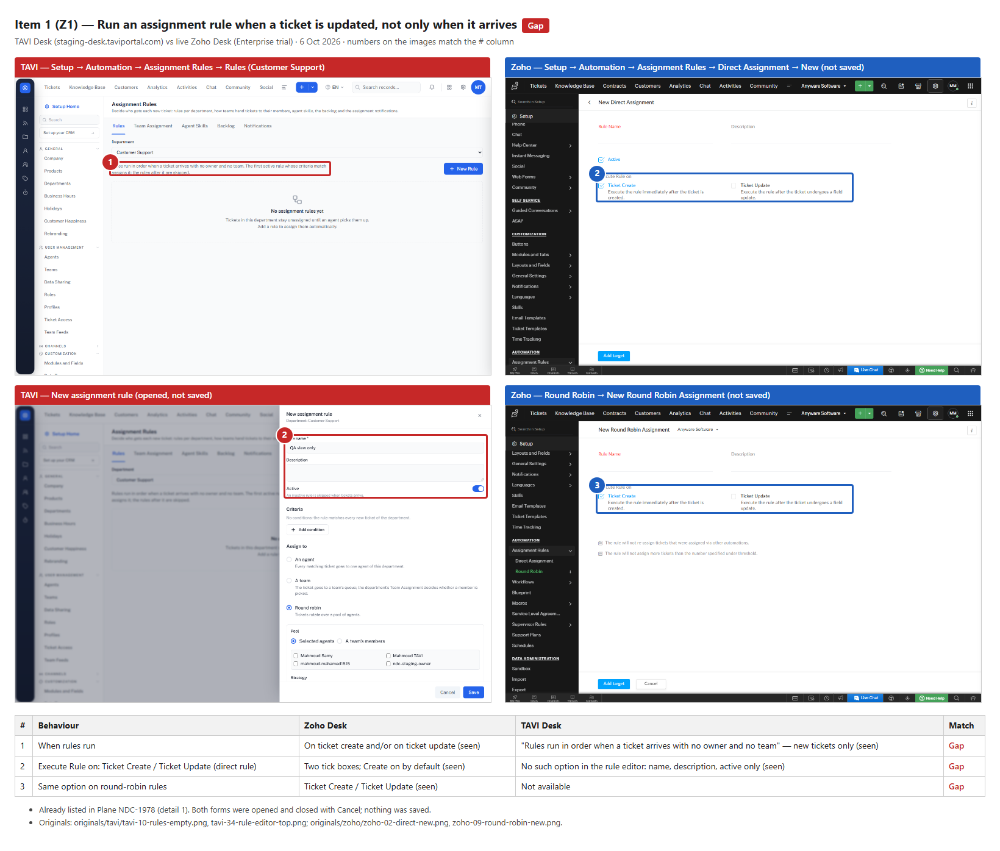

## 2. "Move Ticket to" another department as a rule action

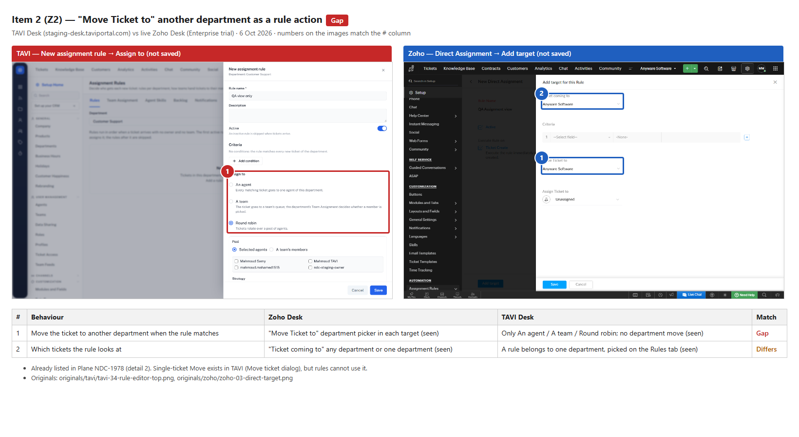

## 3. Execution-time criteria: during / outside business hours, holiday / not a holiday

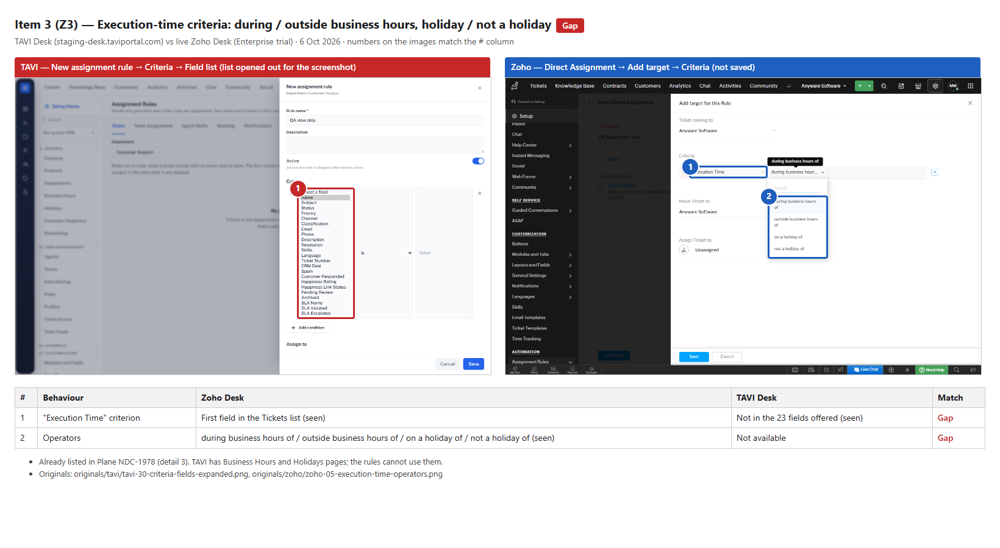

## 4. Date fields and date / number operators in rule criteria

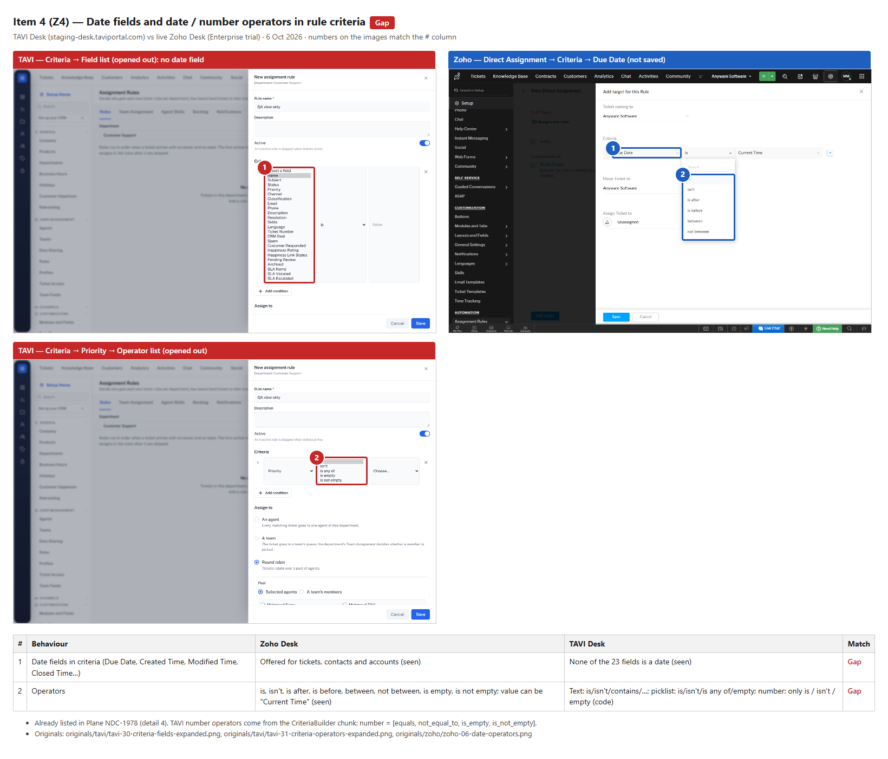

## 5. Criteria on contact and account fields, and on ticket owner, team, tags and dates

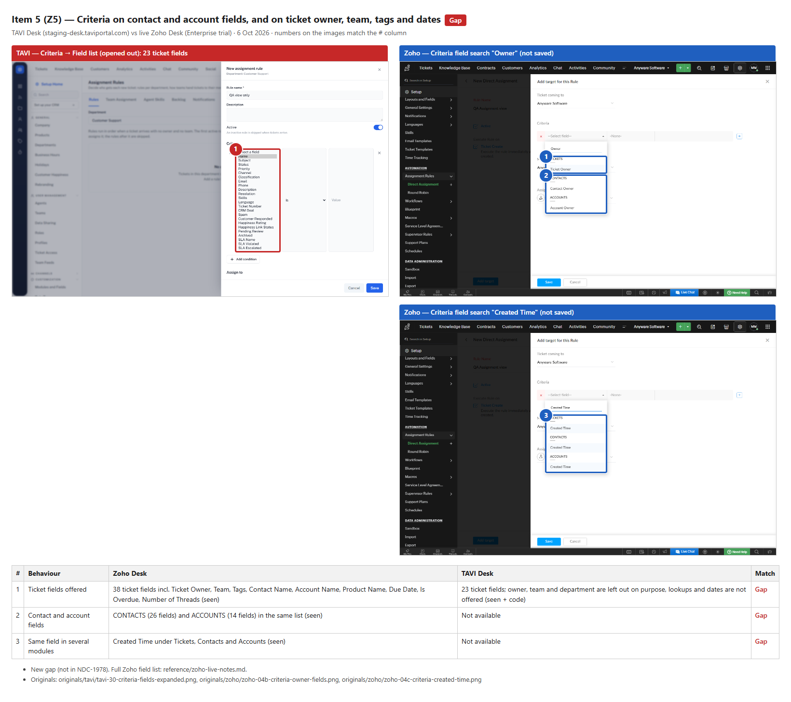

## 6. One switch to turn all direct rules, or all round-robin rules, on or off

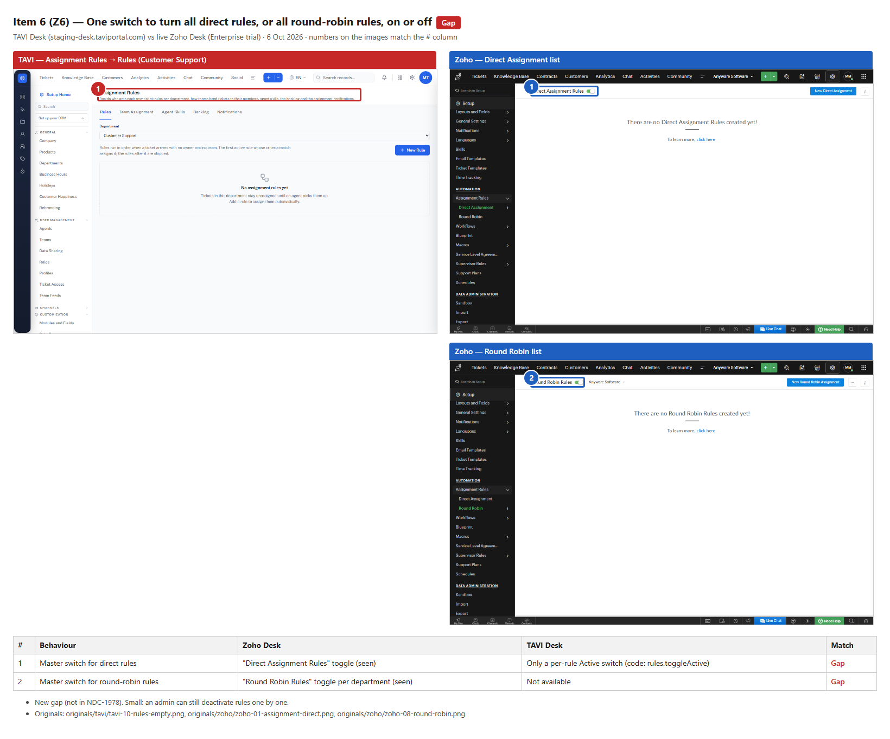

## 7. Exclude chosen agents when round robin uses a team's members

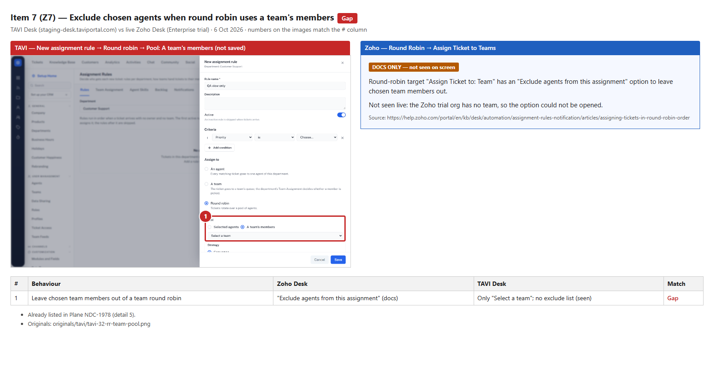

## 8. Round robin only to online agents, with an "Assign tickets to offline agents" switch

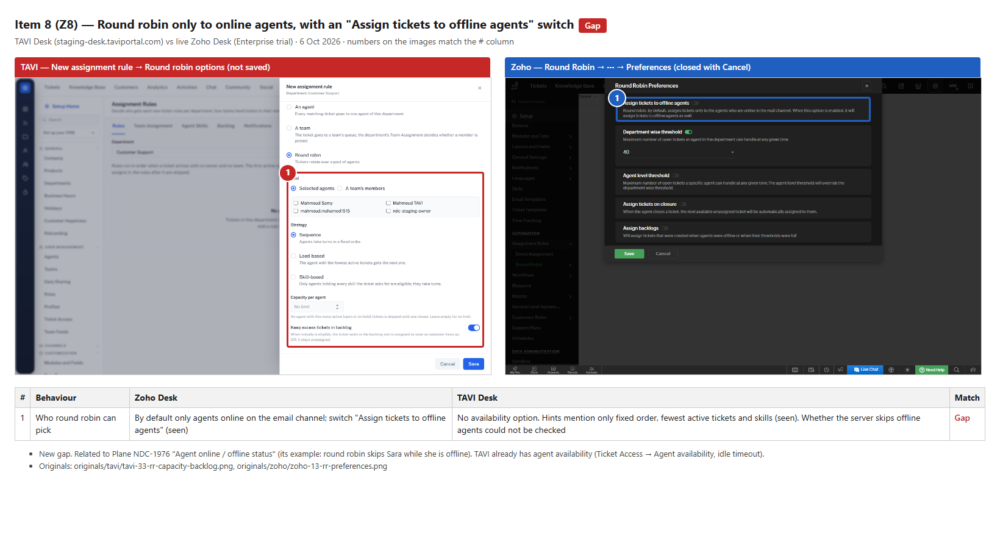

## 9. Department-wide ticket limit and per-agent limit

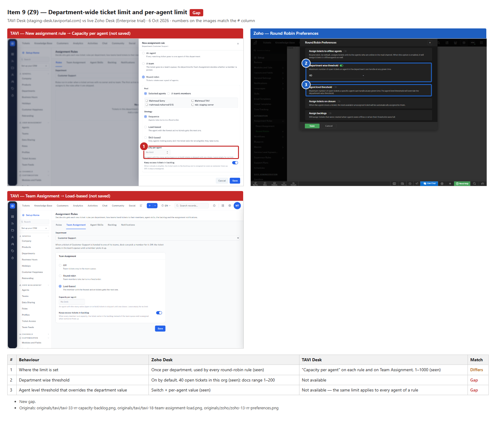

## 10. Backlog options: on/off per department, how many and in which order

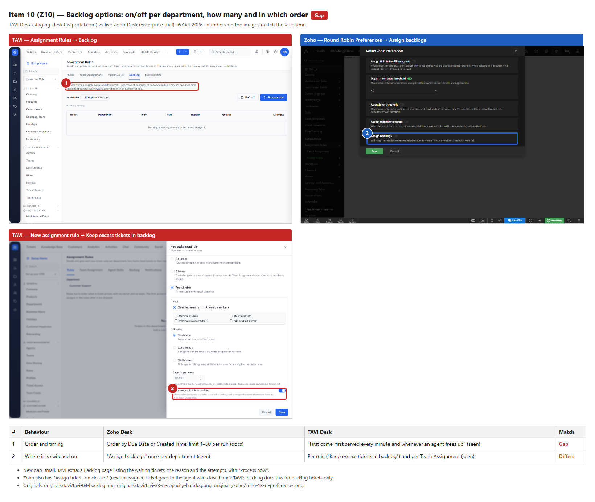

## 11. Skills management: skill types, skills with criteria stamped on tickets, agents per skill

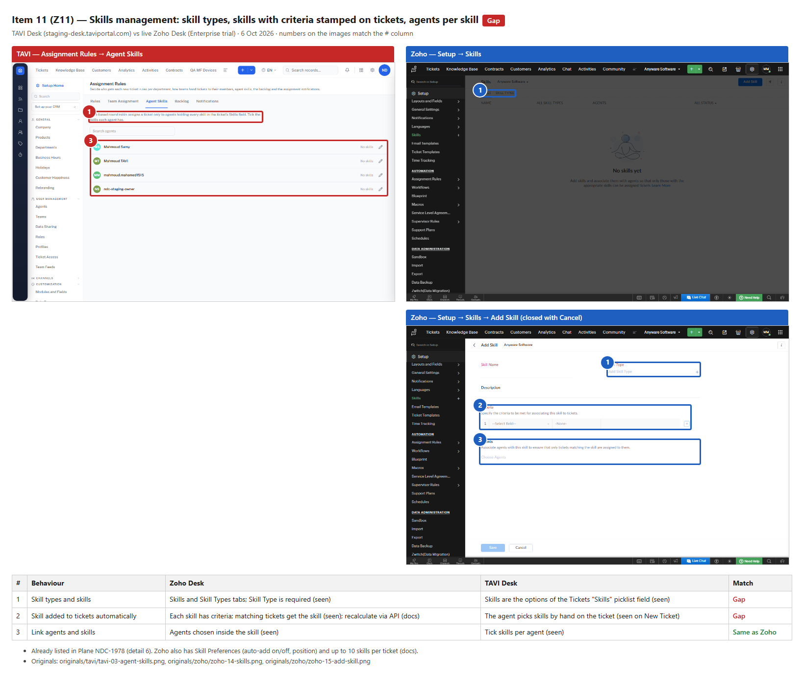

## 12. Workflow action that assigns a ticket to a team or to an agent in a team

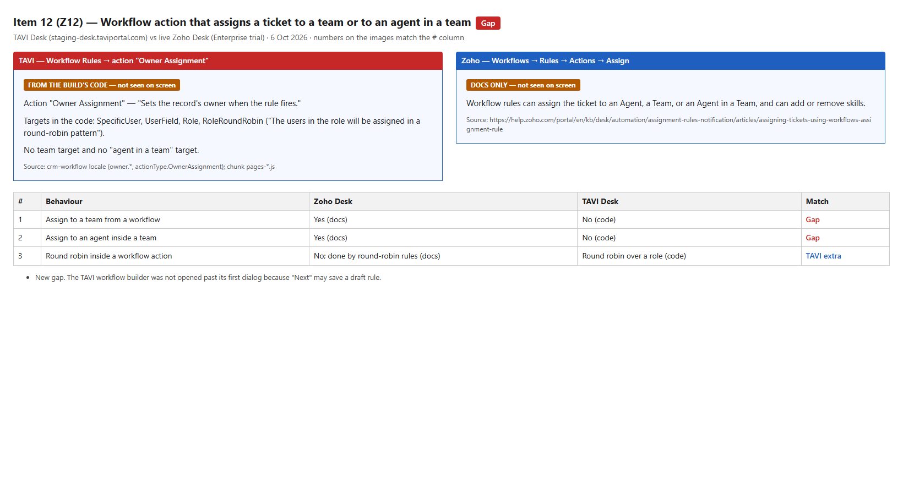

## 13. AI suggestion of the ticket owner (Zia Field Predictions)

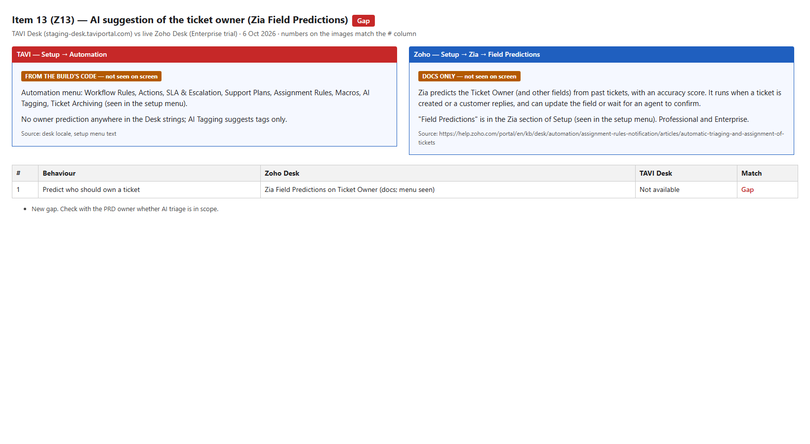

## 14. Assignment notifications per department, per channel, with editable templates

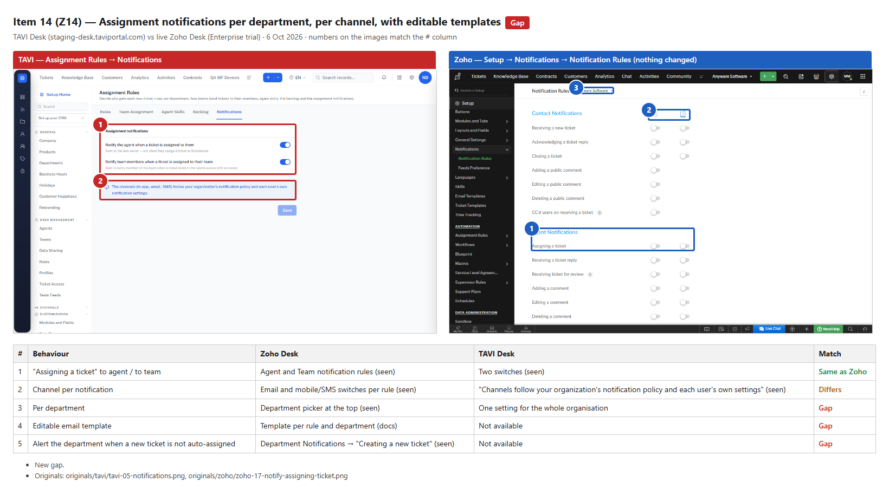

## 15. Assignment API coverage

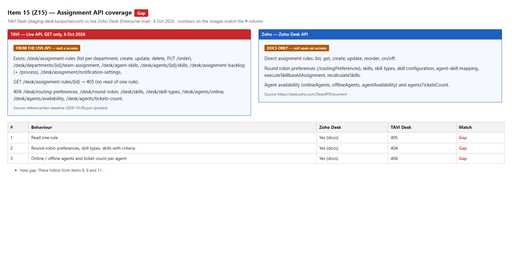
