# Evidence — Modules, tabs and fields: TAVI Desk vs Zoho Desk

| | |
|---|---|
| App | TAVI Desk — `https://staging-desk.taviportal.com` (tenant NDC-Staging), second admin account |
| Reference | Zoho Desk, live org "anywaresoftwaredesk" (Enterprise trial), admin "CEO", Edge |
| Date | 5 Oct 2026 |
| Missing list | [`../desk-modules-fields-missing-list.md`](../desk-modules-fields-missing-list.md) (items 1–12) |
| Test spec | [`../spec-desk-modules-fields.md`](../spec-desk-modules-fields.md) (Group Z rows Z8–Z19) |
| Status | Draft for review. Nothing filed in Plane |

How to read each image:
- **TAVI** is on the left (red), and **live Zoho Desk** is on the right (blue).
- The numbered boxes on the screenshots match the **#** column of the table under them.
- **Match** is one of: Gap (Zoho has it, TAVI does not), Differs, Same as Zoho, TAVI extra, or Not checked.
- "(seen)" means it was on screen. "(docs)" means it comes from Zoho's help pages only. "(API)" means it comes from TAVI's API data, not the screen.

All captures were read-only. Menus and panels were opened, captured, then closed with Cancel or Escape, and no save request was sent in either app. The unannotated screenshots are in [`originals/`](originals/). To rebuild an image, edit its file in `configs/` and run `node make-evidence.js configs/<item>.json`.

## Summary

| # | Gap | Spec row | Zoho evidence | Verdict |
|---|---|---|---|---|
| 1 | Tab bar set by the admin for everyone | Z8 | Live + docs | Gap |
| 2 | Rename any tab | Z9 | Live | Gap (+ possible bug) |
| 3 | Search Fields setting per module | Z10 | Live | Gap |
| 4 | Standard fields are protected | Z11 | Live | Gap |
| 5 | Department-specific layouts and the Department field | Z12 | Live | Gap |
| 6 | Missing or different standard fields | Z13 | Live | Gap |
| 7 | Picklist tools (bulk add, sort, Replace Values) | Z14 | Live | Gap |
| 8 | Rounding options for Decimal and Currency | Z15 | **Docs only** | Gap |
| 9 | Lookup options (filter, search, display, auto-fill) | Z16 | **Docs only** | Gap |
| 10 | Help Center settings on a layout | Z17 | Live + docs | Gap |
| 11 | Ticket Status page with status types | Z18 | Live | Gap |
| 12 | Agents as a customisable module | Z19 | Live | Gap |

---

## 1. Tab bar set by the admin for everyone (Z8)

- **TAVI:** Organize Tabs says "Changes apply to you only." Each user arranges their own bar.
- **Zoho:** Organize Tabs is an admin page under Setup → Modules and Tabs. The docs say a hidden module "won't appear regardless of user profile".
- Reordering and hiding work the same in both. TAVI also has "Reset to default".
- The scope is not stated on the Zoho screen, so that part is docs. Spec test K7 proves the TAVI side with a second user.

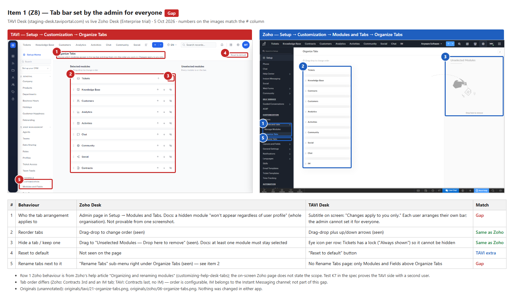

## 2. Rename any tab (Z9)

- **Zoho:** a Rename Tabs page with display names for 19 tabs, including Knowledge Base, Reports, Dashboards, Analytics, Customers, Activities, Community, Social, Chat and IM.
- **TAVI:** no such page. The module list holds only the 9 record modules.
- **Possible bug (box 3):** Tickets layout builder → gear (Layout settings) → **Rename Module** crashes the page with "Cannot read properties of undefined (reading 'trim')". This happened both times I tried.

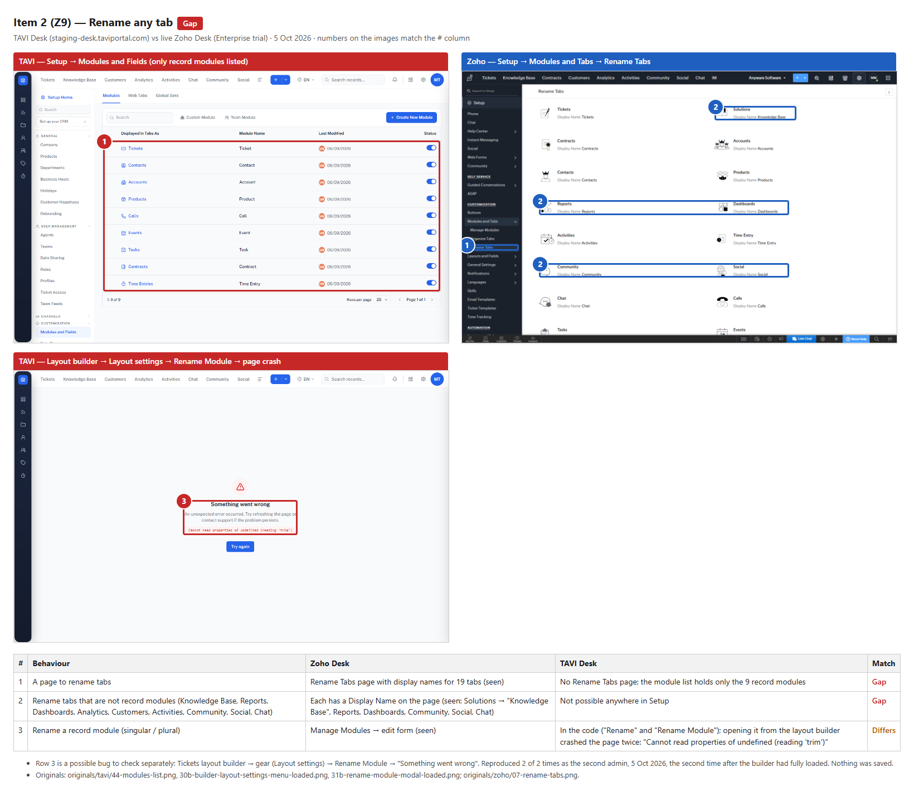

## 3. Search Fields setting per module (Z10)

- **Zoho:** Layouts and Fields → Search Fields, with All Fields / Specific Fields and a tick box per field. The docs say up to 10 fields per module (6 for Contracts, Products and Activities).
- **TAVI:** the module page has only Layouts, Fields, Workflow Rules and Summary. There is no search setting anywhere in Customization.

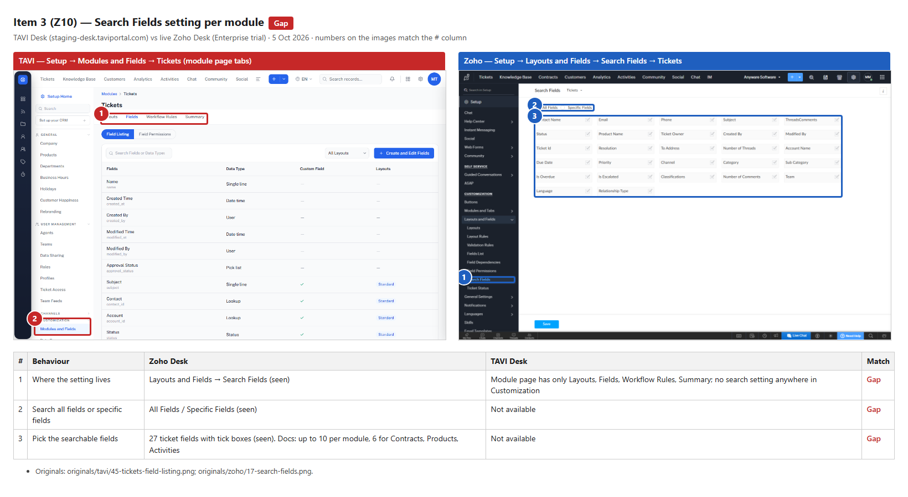

## 4. Standard fields are protected (Z11)

- **Zoho:**
  - Core fields show "Non-removable standard field".
  - On Contact Name, "Mark as required" is ticked and disabled, and "Remove Field" is disabled.
  - No standard field is marked custom.
- **TAVI:**
  - Field Listing ticks "Custom Field" on Subject, Contact, Account and Status.
  - Calls Subject offers "Unmark as Required".
  - "Remove from Layout" is disabled only while a field is required.
- Rows 4–5 for TAVI come from the API permission flags. They were read, not clicked.

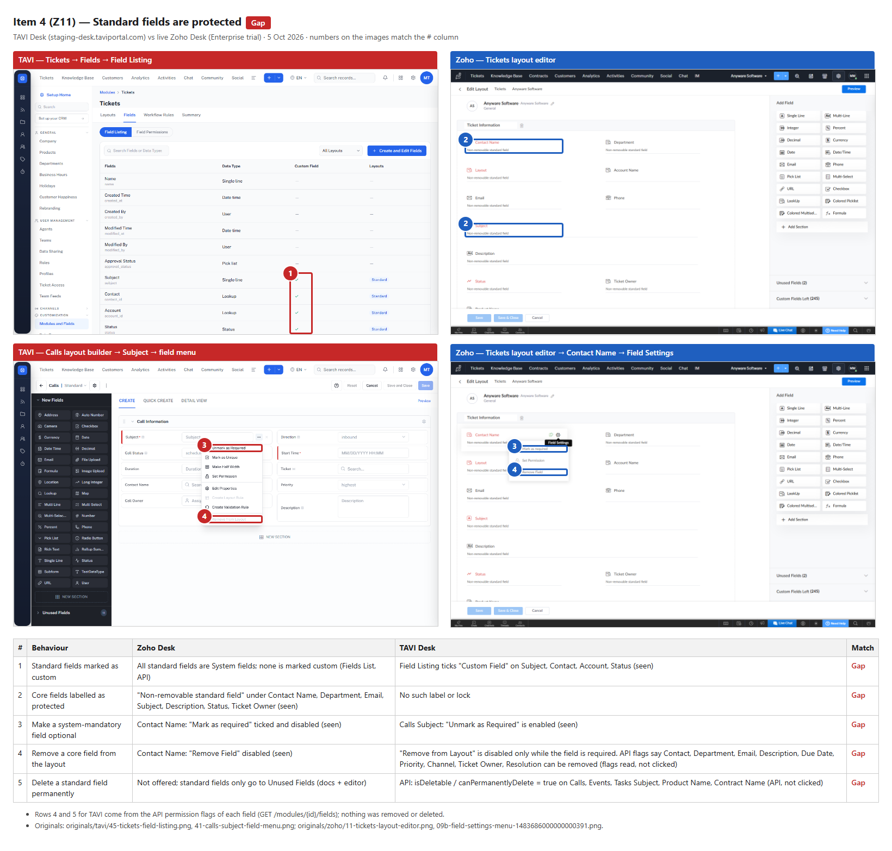

## 5. Department-specific layouts and the Department field (Z12)

- **Zoho:** there is a department picker on Layouts and in the layout editor. Department is mandatory and non-removable on Tasks.
- **TAVI:**
  - Layouts are shared to profiles only, with no department.
  - On Tasks, Department sits in Unused Fields and is optional.
- TAVI department storage could not be tested because the tenant shows 0 departments.

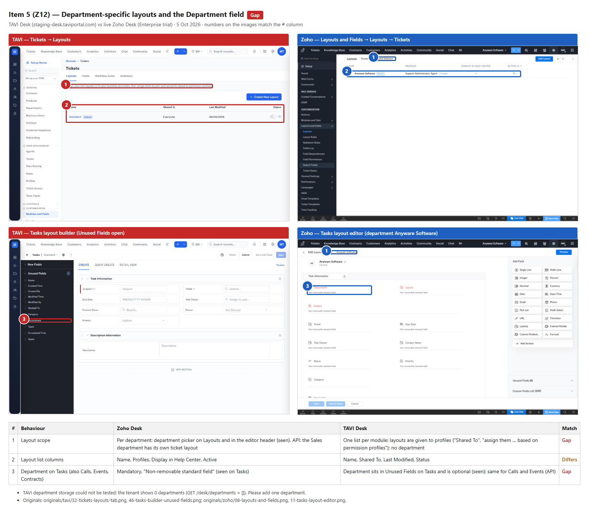

## 6. Missing or different standard fields (Z13)

- **Tickets:** Zoho has Category and Sub Category (Fields List). TAVI has neither, not even in Unused Fields.
- **Accounts:**
  - Zoho keeps Annual Revenue, Industry, Fax, Street, City, State, Code and Description in Unused Fields.
  - TAVI has no Annual Revenue, and has one compound Address field instead of separate address fields.
- **Other modules (row 5):** the details are in [`../reference/zoho-desk-live-inventory.md`](../reference/zoho-desk-live-inventory.md).

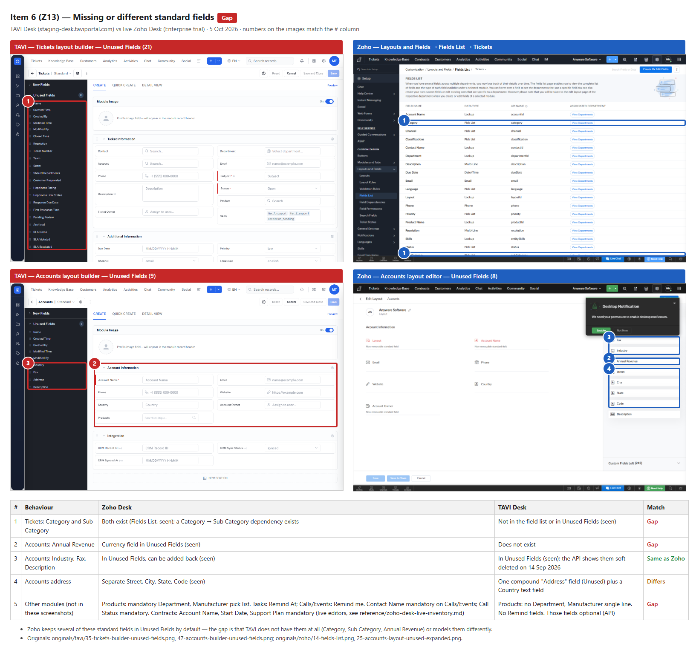

## 7. Picklist tools (Z14)

- **Zoho:**
  - "Replace Values" in the field menu.
  - "Add Values in Bulk".
  - Import, clear, sort and expand icons above the value list.
- **TAVI:** options are added one at a time, and there is no Replace Values item.
- TAVI's Priority options show stored keys (`low`, `medium`, `high`, `urgent`). This is listed as a possible bug.

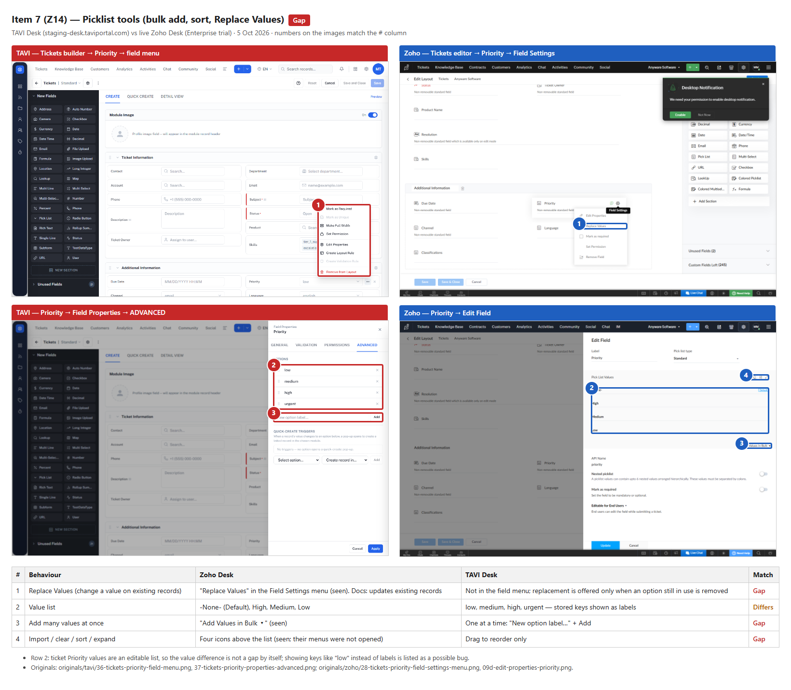

## 8. Rounding options for Decimal and Currency fields (Z15) — Zoho side docs only

- **TAVI:** Unit Price shows only the currency symbol and auto-fill (ADVANCED), and the label and API name (GENERAL). The VALIDATION tab was not opened.
- **Zoho:** the docs list Normal, Round Off, Round Down and Round Up, plus decimal places. This was not seen live, because the field palette works by dragging and nothing was dragged.

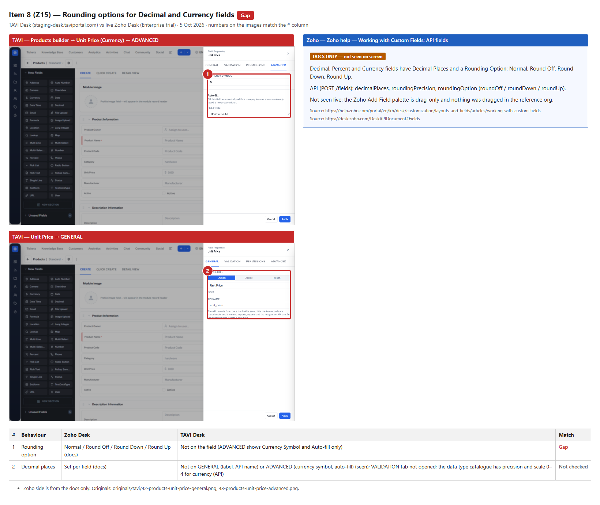

## 9. Lookup options (Z16) — Zoho side docs only

- **TAVI:** lookup module, display field and related list title. It also has a multi-module option, which Zoho does not have.
- **Zoho docs:**
  - Filter which records can be picked (up to 5 criteria).
  - Search by up to 6 fields.
  - Show up to 6 fields in the pop-up.
  - Sort the records.
  - Fill up to 5 fields from the chosen record.

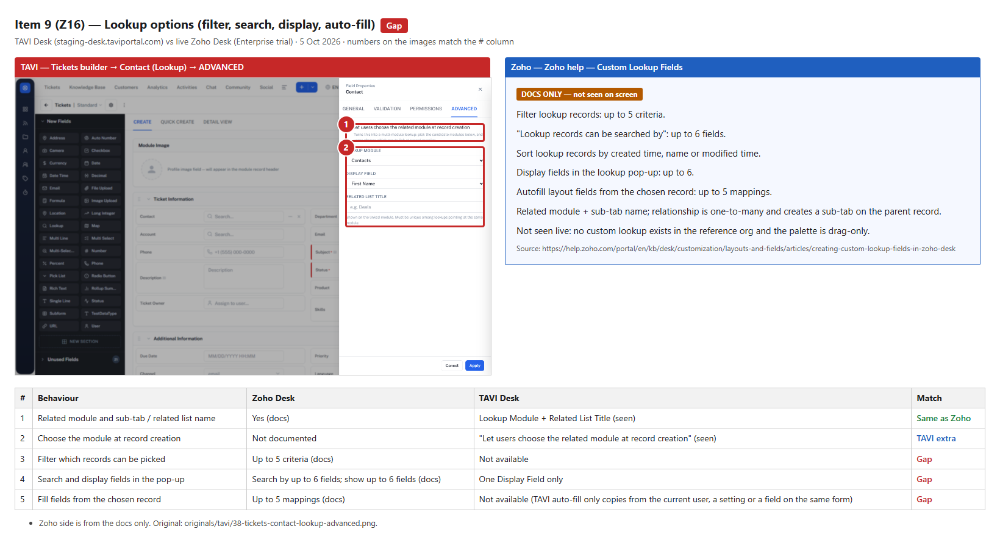

## 10. Help Center settings on a layout (Z17)

- **Zoho:** the Layouts list has a "Display in Help Center" column, ticked for the default ticket layout. The docs list the Add Layout options.
- **TAVI:** no such column. "Create New Layout" opens an unsaved builder called "New Layout", with no description or Help Center options. Nothing was saved.

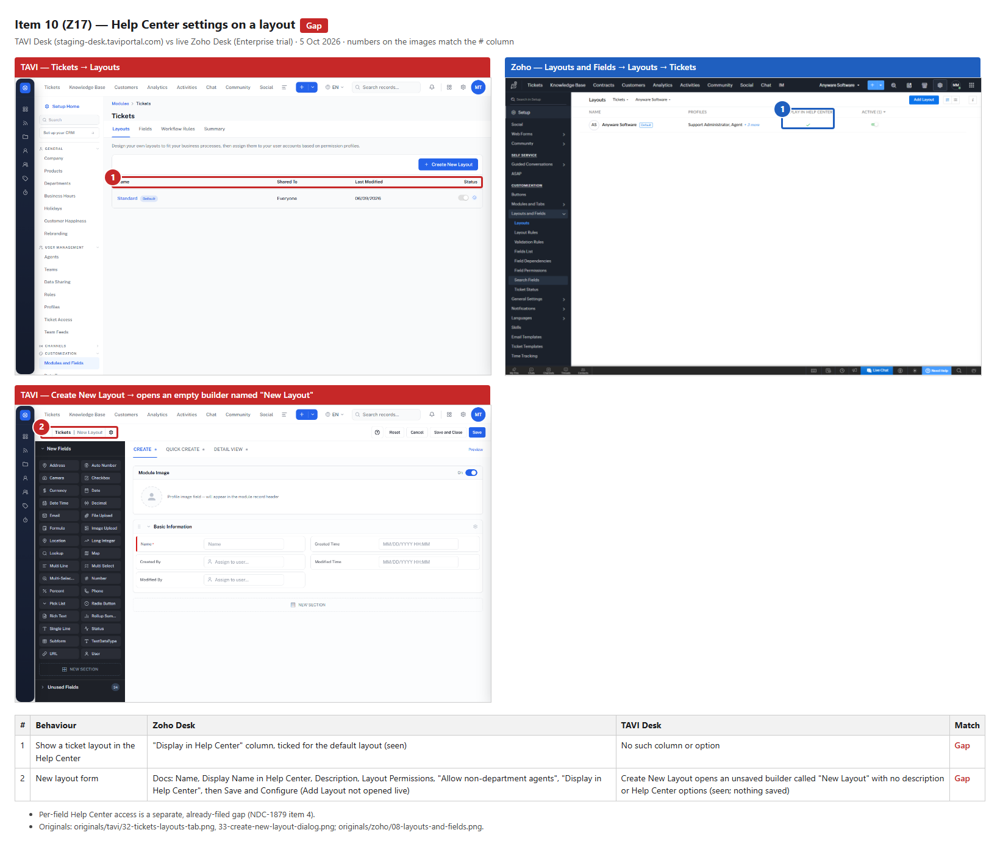

## 11. Ticket Status page with status types (Z18)

- **Zoho:** a Ticket Status page per department, with a Status Type for each status (Open → OPEN, On Hold → ON HOLD, Escalated → OPEN, Closed → CLOSED). On Hold pauses the SLA clock.
- **TAVI:** statuses are just the options of the Status field.
- Check whether a Tickets or SLA gap item already covers this before filing.

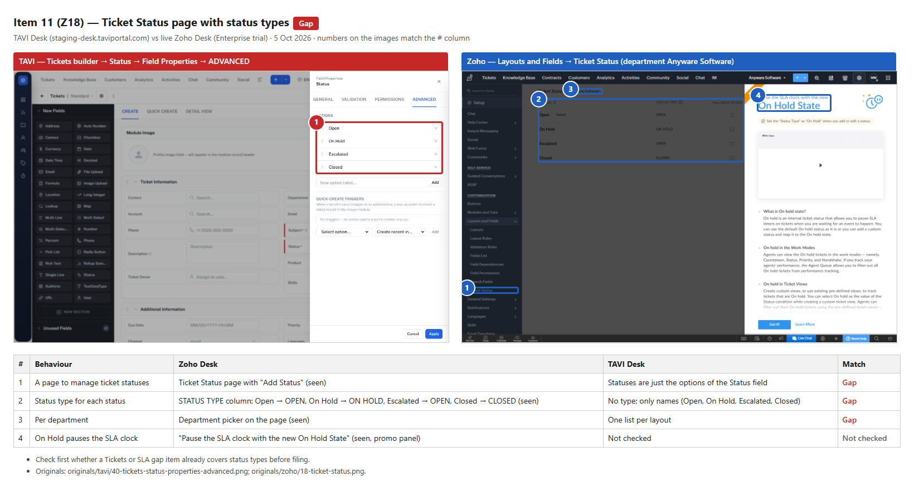

## 12. Agents as a customisable module (Z19)

- **Zoho:** Agents is an organisation-level module with its own layout (2 sections, non-removable core fields), 15 field types and 240 custom fields left.
- **TAVI:** no Agents module in Modules and Fields.
- Check NDC-1878 (Agents gaps) before filing.

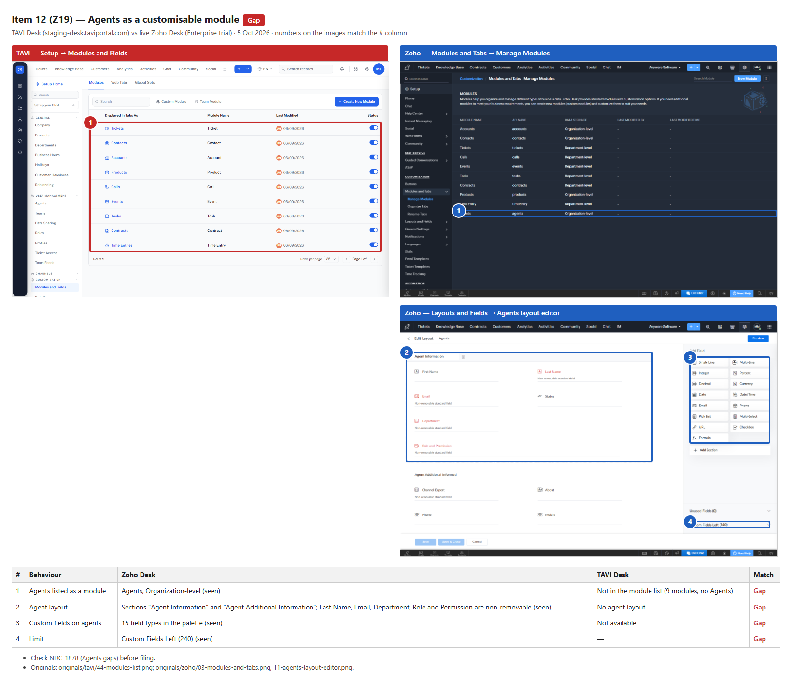

---

## Not shown as images

- **Already filed in NDC-1879** (layout rules, validation rules, picklist values per layout, Help Center access per field, nested and colour-coded picklists, encryption) and **NDC-1866 item 16** (ticket number format). Their Zoho side is in `originals/zoho/`: `12-layout-rules.png`, `13-validation-rules.png`, `09d-edit-properties-priority.png` and `11-tickets-layout-editor.png`.
- **Possible bugs** other than the Rename Module crash are described in the missing list's "Additional notes" and have no annotated image.
