# Custom Views - defects found on staging (bugs only)

**Run:** execu_2026-10-05_11-20-40 · **Target:** https://staging-crm.taviportal.com (tenant NDC-Staging) · **Dates:** 5-6 Oct 2026
**Scope:** all 178 non-Missing cases of *Custom Views - Spec v3 Test Cases.xlsx* · **Mode:** sequential, scripted Playwright (Chromium; Edge/Firefox for L07)
**Result:** 119 Pass · **43 Fail** (3 High · 19 Medium · 21 Low) · 16 Inconclusive
**Run summary (JSON):** [run-summary.json](./run-summary.json) · **Bug list:** [bugs/bug-list.md](./bugs/bug-list.md)

This report lists **failed cases only**. Each bug has an annotated side-by-side image: TAVI (staging) on the left, the live Zoho CRM reference org on the right (Zoho was only read, never changed). Where Zoho could not be checked without changing it, the table says "Not checked live". Passed cases are summarised in run-summary.json and in the "Combined Status" sheet.

## How the run was done
- **Accounts:** the Owner account was signed in by another operator throughout the day (every sign-in revokes the other session), so most cases ran as **ALT1** (CRM Admin, "Mahmoud Mohamed") in the Owner role. Lower-profile cases used **test user 1** (User profile; has Manage Shared Views, no view-all on Leads) and **test user 2** (profile "test"; no Manage Shared Views). Owner was used only for a few A-group checks and the final cleanup.
- **Build:** the staging front end changed during the run (index-B5S13X_E.js -> index-Bzy9m5yg.js); the backend and tenant stayed the same.
- **Verdicts aligned with Zoho:** when TAVI behaves exactly like Zoho and the case text asks for more (H01, J01 empty states; I19 / E2E-3 board scroll after Back; I20 board search), the case was passed with a note rather than reported as a bug.
- **Test data:** everything created is prefixed "QA CV" and was deleted and purged from the Recycle Bin at the end (see Cleanup). Data of the other operator ("ZZSWEEP…", "AEX-01…", "QA CV wrong-type", "QA CV d19-control", "QA CV amount-format ui …", "QA CV link-field", "QA CV R01-R04") was not touched.

## Defects (43)

| # | Severity | Case | Defect | Evidence |
|---|---|---|---|---|
| 1 | High | CVS-D08 | Date-time 'today/yesterday/tomorrow' criteria use the UTC day instead of the tenant timezone (Cairo) | [vs Zoho](./bugs/screenshots/owner-112040-7855-D08-vs-zoho.png) |
| 2 | High | CVS-E12 | A user without the review permission can filter by review_status through the views API (condition accepted and applied), exposing review data | [vs Zoho](./bugs/screenshots/owner-112040-7855-E12-vs-zoho.png) |
| 3 | High | CVS-K07 | A criterion on a field hidden from the viewer exposes its value in the view editor and the view API | [vs Zoho](./bugs/screenshots/owner-112040-7855-K07-vs-zoho.png) |
| 4 | Medium | CVS-B14 | ?view= with a deleted or foreign view ID falls back to the last-used view instead of All Leads | [vs Zoho](./bugs/screenshots/owner-112040-7855-B14-vs-zoho.png) |
| 5 | Medium | CVS-B15 | List preferences changed in two browser tabs: the later write silently overwrites the earlier one (lost update, no version conflict) | [vs Zoho](./bugs/screenshots/owner-112040-7855-B15-vs-zoho.png) |
| 6 | Medium | CVS-D05 | View API accepts non-numeric Amount values ('abc', '15,000', '1e9') and stores them as raw strings that match nothing | [vs Zoho](./bugs/screenshots/owner-112040-7855-D05-vs-zoho.png) |
| 7 | Medium | CVS-D16 | Lookup criteria in the view editor take free text only (no record picker); a typed record name is saved literally and matches nothing | [vs Zoho](./bugs/screenshots/owner-112040-7855-D16-vs-zoho.png) |
| 8 | Medium | CVS-D19 | View API accepts an operator that does not fit the field type (Amount 'contains' -> 201) | [vs Zoho](./bugs/screenshots/owner-112040-7855-D19-vs-zoho.png) |
| 9 | Medium | CVS-D24 | Arabic UI: the criteria pattern '(1 or 2) and (3 or 4)' is displayed as '( and (3 or 4) (or 2 1) )' | [vs Zoho](./bugs/screenshots/owner-112040-7855-D24-vs-zoho.png) |
| 10 | Medium | CVS-D25 | 'Last Activity' in view criteria is the record's modified time; adding a note does not update it | [vs Zoho](./bugs/screenshots/owner-112040-7855-D25-vs-zoho.png) |
| 11 | Medium | CVS-E2E-1 | After sign-out/sign-in Leads does not reopen the working view the user had open | [vs Zoho](./bugs/screenshots/owner-112040-7855-E2E-1-vs-zoho.png) |
| 12 | Medium | CVS-E09 | Deleted criteria field: no banner on the view's list page (only in the editor, by API name) while the view keeps filtering on the deleted field | [vs Zoho](./bugs/screenshots/owner-112040-7855-E09-vs-zoho.png) |
| 13 | Medium | CVS-F01 | Manage Columns on a view with chosen columns offers no hidden/available fields, so a column (e.g. Comment) cannot be added | [vs Zoho](./bugs/screenshots/owner-112040-7855-F01-vs-zoho.png) |
| 14 | Medium | CVS-F03 | Manage Columns cannot add a column to a view (so a new column cannot be saved to the view) | [vs Zoho](./bugs/screenshots/owner-112040-7855-F03-vs-zoho.png) |
| 15 | Medium | CVS-F10 | Row selection is kept when switching to another view (bar still '3 selected') | [vs Zoho](./bugs/screenshots/owner-112040-7855-F10-vs-zoho.png) |
| 16 | Medium | CVS-G04 | Clone in the picker row menu (dropdown layout) does nothing | [vs Zoho](./bugs/screenshots/owner-112040-7855-G04-vs-zoho.png) |
| 17 | Medium | CVS-G06 | The 15-pinned-views limit is not enforced (16th pin accepted in UI and API) | [vs Zoho](./bugs/screenshots/owner-112040-7855-G06-vs-zoho.png) |
| 18 | Medium | CVS-H14 | Records whose value is beyond the 75-column cap vanish from the Kanban board; board-summary says truncated=false | [vs Zoho](./bugs/screenshots/owner-112040-7855-H14-vs-zoho.png) |
| 19 | Medium | CVS-I04 | A record holding a removed pick-list value is shown in an unmarked extra column - no 'no longer an option' flag | [vs Zoho](./bugs/screenshots/owner-112040-7855-I04-vs-zoho.png) |
| 20 | Medium | CVS-I05 | Deals Kanban by Stage has no pipeline picker, ignores the pipeline's stages and shows no stage probability | [vs Zoho](./bugs/screenshots/owner-112040-7855-I05-vs-zoho.png) |
| 21 | Medium | CVS-I09 | Dropping a deal on Closed Won/Lost opens no closing dialog - the move just fails with 'Closing Date is required' | [vs Zoho](./bugs/screenshots/owner-112040-7855-I09-vs-zoho.png) |
| 22 | Medium | CVS-I11 | Kanban move from a stale board overwrites a newer change with no conflict check | [vs Zoho](./bugs/screenshots/owner-112040-7855-I11-vs-zoho.png) |
| 23 | Low | CVS-C02 | View name validation messages are never shown: empty/space-only names just disable Save, and a 121-character name is silently cut to 120 | [vs Zoho](./bugs/screenshots/owner-112040-7855-C02-vs-zoho.png) |
| 24 | Low | CVS-C09 | A view's grid shows two columns that were not chosen (Tags and Source are always appended) | [vs Zoho](./bugs/screenshots/owner-112040-7855-C09-vs-zoho.png) |
| 25 | Low | CVS-C12 | Page size 200 is accepted by the server but cannot be chosen in the editor; with 200 stored the editor shows 'Select…' and the grid's Rows per page reads 10 | [vs Zoho](./bugs/screenshots/owner-112040-7855-C12-vs-zoho.png) |
| 26 | Low | CVS-D14 | A pick list value removed from the field is not shown in the view editor (blank 'Value', no warning), although the view still filters on it | [vs Zoho](./bugs/screenshots/owner-112040-7855-D14-vs-zoho.png) |
| 27 | Low | CVS-D21 | An unbracketed criteria pattern is stored and redisplayed as typed instead of in its fully bracketed form | [vs Zoho](./bugs/screenshots/owner-112040-7855-D21-vs-zoho.png) |
| 28 | Low | CVS-D22 | Upper-case 'AND' pattern is accepted by the editor and the API (case expects it to be rejected) | [vs Zoho](./bugs/screenshots/owner-112040-7855-D22-vs-zoho.png) |
| 29 | Low | CVS-E07 | Module with no related modules: the editor still shows an empty related block and an enabled 'Add condition' | [vs Zoho](./bugs/screenshots/owner-112040-7855-E07-vs-zoho.png) |
| 30 | Low | CVS-F04 | List preferences accept more than 50 column overrides (51 stored); no oldest-dropped or 4xx rule | [vs Zoho](./bugs/screenshots/owner-112040-7855-F04-vs-zoho.png) |
| 31 | Low | CVS-F06 | Toolbar sort label shows API names ('Sort: amount desc') instead of the field label and direction | [vs Zoho](./bugs/screenshots/owner-112040-7855-F06-vs-zoho.png) |
| 32 | Low | CVS-F07 | Rows per page offers 10/25/50/100 only - 200 is missing | [vs Zoho](./bugs/screenshots/owner-112040-7855-F07-vs-zoho.png) |
| 33 | Low | CVS-H05 | Kanban view form: an over-long name gets only 'The view is not valid.' - the 120-character limit is not shown or enforced in the field | [vs Zoho](./bugs/screenshots/owner-112040-7855-H05-vs-zoho.png) |
| 34 | Low | CVS-H10 | Kanban chooser does not label other users' views with 'Shared by <name>' | [vs Zoho](./bugs/screenshots/owner-112040-7855-H10-vs-zoho.png) |
| 35 | Low | CVS-J03 | Split view criteria: the 'Add criteria row' button silently disables at 10 rows - no limit message | [vs Zoho](./bugs/screenshots/owner-112040-7855-J03-vs-zoho.png) |
| 36 | Low | CVS-L01 | Arabic UI: 'records' in the record count and the sort label's field/direction are not translated | [vs Zoho](./bugs/screenshots/owner-112040-7855-L01-vs-zoho.png) |
| 37 | Low | CVS-L03 | Arabic: header layout picker accessible name stays 'Layout'; 'records' untranslated | [vs Zoho](./bugs/screenshots/owner-112040-7855-L03-vs-zoho.png) |
| 38 | Low | CVS-L04 | Keyboard: focus drops to <body> after 'Add criteria row'; picker list has no arrow-key navigation | [vs Zoho](./bugs/screenshots/owner-112040-7855-L04-vs-zoho.png) |
| 39 | Low | CVS-L05 | Kanban a11y names: card checkboxes reuse the column select-all name, column buttons lack the column name, drag announcements read UUIDs | [vs Zoho](./bugs/screenshots/owner-112040-7855-L05-vs-zoho.png) |
| 40 | Low | CVS-L06 | At 390 px the 'Create Lead' button is cut off at the right edge | [vs Zoho](./bugs/screenshots/owner-112040-7855-L06-vs-zoho.png) |
| 41 | Low | CVS-L07 | Firefox: React ErrorBoundary console error from a lazy-loaded component during the view/Kanban flow | [vs Zoho](./bugs/screenshots/owner-112040-7855-L07-vs-zoho.png) |
| 42 | Low | CVS-L08 | List first page p95 far above 1.5 s (Leads 9.1 s, Deals 3.3 s) | [vs Zoho](./bugs/screenshots/owner-112040-7855-L08-vs-zoho.png) |
| 43 | Low | CVS-L09 | Kanban headers + first cards p95 5.1 s (target 2 s) | [vs Zoho](./bugs/screenshots/owner-112040-7855-L09-vs-zoho.png) |

---
### 1. CVS-D08 - Date-time 'today/yesterday/tomorrow' criteria use the UTC day instead of the tenant timezone (Cairo)
**Severity:** High · **Case:** today, yesterday and tomorrow resolve in the tenant timezone (Cairo), not UTC · **Area:** Relative Days in Cairo Time

**Steps to reproduce**
1. Open Leads → New custom view 'QA CV date-rel' with Name starts_with 'QA CV' and Date Time Permission today; Save.
2. At 23:50 Cairo, open the view and record the result; edit to yesterday and tomorrow and record each.
3. At 00:10 Cairo (next day), repeat step 2.
4. Cross-check: apply the same condition in the Leads Filter panel, or call GET /api/v1/modules/841043e1-c078-41f9-8d6e-dfd61bee45c3/records?filters=<same condition>, and compare the total with the grid's record count.
5. Cleanup: delete 'QA CV date-rel' and purge it from the Recycle Bin.

**Expected:** At 23:50 on D: today → L02, L03 · yesterday → L01 · tomorrow → L04. At 00:10 on D+1: today → L04 · yesterday → L02, L03 · tomorrow → none of L01–L04. Results follow the Cairo date, never the UTC date, and match the module filter.

**Actual (this run):** Date Time Permission seeds: T01 4 Oct 23:50, T02 5 Oct 00:10, T03 5 Oct 23:50, T04 6 Oct 00:10 Cairo (stored UTC). At 13:37 Cairo on 5 Oct: today -> T03, T04 (expected T02, T03); yesterday -> T01, T02 (expected T01); tomorrow -> none (expected T04). The grid shows T04 as '06/10/2026 12:10 AM' inside the Today view. The relative operators use the UTC date, not the Cairo date. Grid and module filter agree. (The case's 23:50 / 00:10 run times were not needed: the UTC-vs-Cairo split shows at any time.)

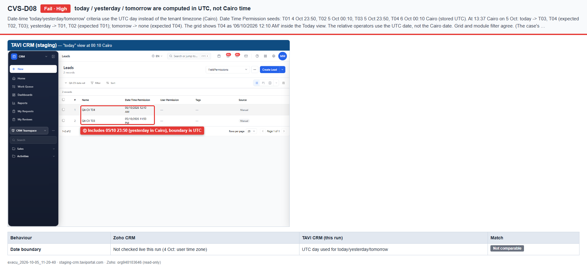

---
### 2. CVS-E12 - A user without the review permission can filter by review_status through the views API (condition accepted and applied), exposing review data
**Severity:** High · **Case:** The review_status field is not offered to a user without the review permission · **Area:** Review Status Permission Gate

**Steps to reproduce**
1. As OWNER, open Leads → New custom view and confirm Review status is offered in the field list; Cancel.
2. As USER, open Leads → New custom view and search the field list for Review status.
3. As USER, POST /api/v1/modules/841043e1-c078-41f9-8d6e-dfd61bee45c3/views named 'QA CV review-gate' with a review_status condition.
4. Record the status code and, if created, GET the view.
5. Cleanup: delete 'QA CV review-gate' and purge it from the Recycle Bin.

**Expected:** OWNER is offered Review status; USER is not. The API refuses the review_status condition from USER (or ignores it — record which); USER never gets review data through a view.

**Actual (this run):** Field list: ALT1 (CRM Admin) is offered 'Review Status'; test user 1 (User profile, no review permission) is not (only 'Approval Status'). FAIL: as test user 1, POST view 'QA CV review-gate' with review_status equals 'approved' -> 201, stored as sent, and the view filters on it: 4 of test user 1's 20 visible leads are returned (pending / rejected / not_submitted -> 0). The records filter API also accepts review_status from test user 1. A user without the review permission gets review data through a view.

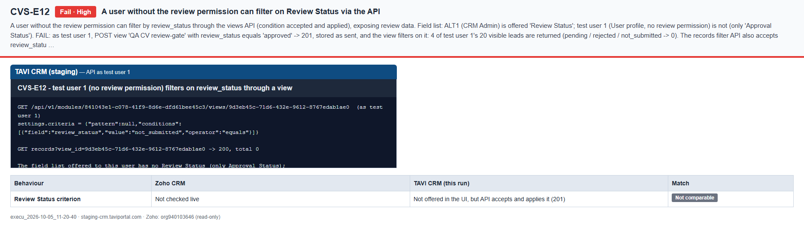

---
### 3. CVS-K07 - A criterion on a field hidden from the viewer exposes its value in the view editor and the view API
**Severity:** High · **Case:** A public view filtering on a field hidden from the viewer follows the Q13 decision and never exposes the value · **Area:** Inference via Hidden-Field Criteria

**Steps to reproduce**
1. As OWNER, create 'QA CV k7' on Leads with Sharing = Everyone and one criterion: <hidden field> equals <value on QA CV L03>.
2. As USER, open 'QA CV k7' and note the records returned.
3. As USER, open Edit on the view and read the criteria.
4. As USER, send GET /api/v1/modules/{m}/views/{v} and read settings.criteria.
5. Record what USER can infer about the hidden field from the name, criteria and results.

**Expected:** Behaviour matches the Q13 decision: either criteria on hidden fields are not allowed on shared views, or the criterion is masked and read-only ("Some fields in this view's criteria are deleted or hidden from you: …") and the exposure is documented. The hidden value never appears in the UI or the API response.

**Actual (this run):** Company is hidden from test user 1 (User profile). QA CV L03 temporarily owned by test user 1 (restored afterwards) so the record is visible but its Company is not. ALT1's 'QA CV k7' (Everyone) filters Company equals <L03's company>. As test user 1: the editor shows the banner 'Some fields in this view's criteria are deleted or hidden from you: company. The view still filters on them.' BUT the criterion row still displays the hidden field and its actual value (Company Equals 'شركة الأمل') in the value box; GET /modules/{Leads}/views/{k7} also returns settings.criteria with the value in plain text; and the grid shows QA CV L03 as the match - so test user 1 learns L03's hidden Company value from the UI and the API.

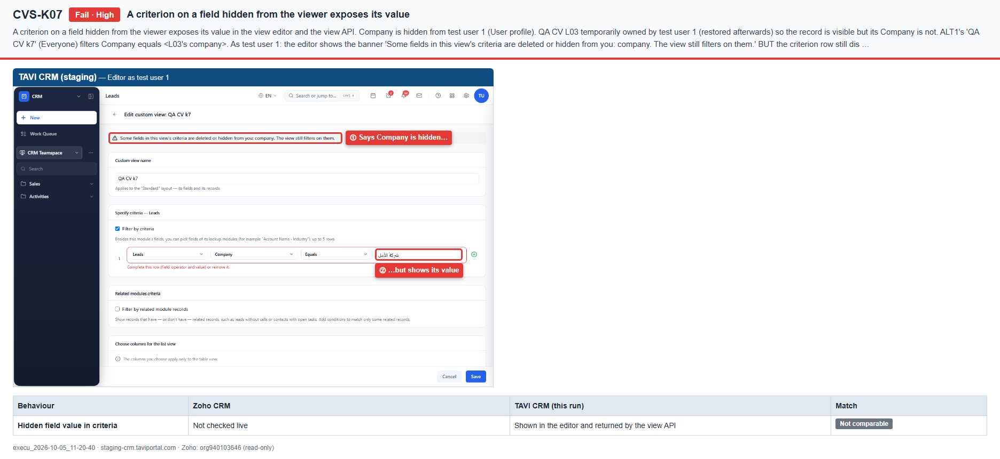

---
### 4. CVS-B14 - ?view= with a deleted or foreign view ID falls back to the last-used view instead of All Leads
**Severity:** Medium · **Case:** The ?view= URL opens permitted views and falls back safely for others · **Area:** View Parameter in URL

**Steps to reproduce**
1. Open /modules/{m}?view={id} with the ID of 'QA CV x'.
2. Repeat with the ID of 'QA CV shared-to-me'.
3. Repeat with the ID of 'QA CV gone'.
4. Repeat with the ID of 'QA CV user-private'.
5. Check the browser console after each.

**Expected:** The own and shared views open. The deleted and foreign IDs fall back to All Leads with no crash, and nothing of the foreign view (name, criteria, records) is shown. Cleanup: delete every 'QA CV' view used and purge them from the Recycle Bin.

**Actual (this run):** ?view= own QA CV x -> opens; QA CV shared-to-me (shared by test user 1) -> opens; deleted QA CV gone and test user 1's private QA CV user-private -> toast 'That view is no longer available. Showing your default view.', ?view= removed, nothing of the foreign view shown, no console errors. FAIL: the fallback is not All Leads - both land on the last-used view (QA CV close11).

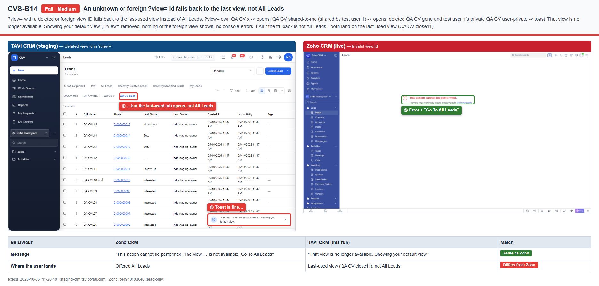

---
### 5. CVS-B15 - List preferences changed in two browser tabs: the later write silently overwrites the earlier one (lost update, no version conflict)
**Severity:** Medium · **Case:** Preferences changed in two browser tabs are saved consistently · **Area:** Two Browser Tabs Preferences

**Steps to reproduce**
1. Open Leads in browser tab 1 and select 'QA CV A'.
2. Open Leads in browser tab 2 and select 'QA CV B'.
3. In tab 1, close the view tab 'QA CV B'.
4. In tab 2, close the view tab 'QA CV A'.
5. Send GET /api/v1/modules/{m}/list-preferences.

**Expected:** Behaviour is consistent and documented: record the final lastListViewId, openListViewIds and recentlyClosedListViewIds. If one tab's change is lost (lost update), record it as a possible bug against the NDC-1869 note. Cleanup: delete 'QA CV A' and 'QA CV B' and purge them from the Recycle Bin.

**Actual (this run):** QA CV A and QA CV B shown as tabs. Tab 1 selected A, tab 2 selected B. Tab 1 closed B (its tab bar: A). Tab 2 (stale) closed A (its tab bar: B). Final list-preferences (version 193): openListViewIds has B and not A; recentlyClosedListViewIds starts with A and does not contain B; after reloading tab 1 the B tab is back. Lost update: tab 2's write replaced the whole preference object and undid tab 1's close; no conflict was raised.

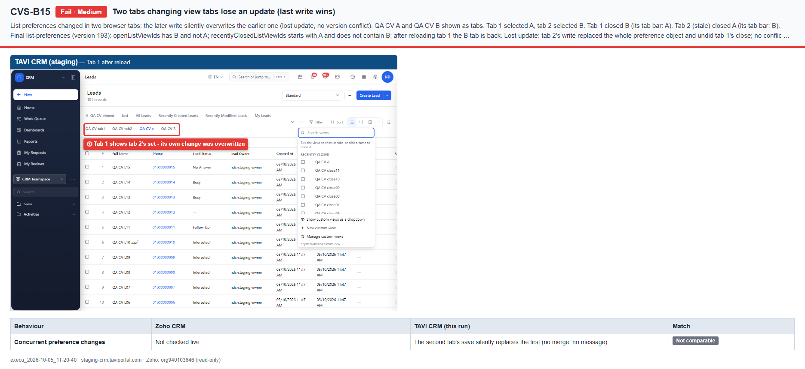

---
### 6. CVS-D05 - View API accepts non-numeric Amount values ('abc', '15,000', '1e9') and stores them as raw strings that match nothing
**Severity:** Medium · **Case:** Odd numeric input is normalised or rejected with a message and is never stored as 15 · **Area:** Number Value Formats

**Steps to reproduce**
1. Open Deals → New custom view 'QA CV amount-format' with Amount equals '15,000'; Save.
2. GET /api/v1/modules/f42cbafd-ab4e-4a6b-a40c-02c1d0ecb430/views/{id} and read the stored value; record the deals returned.
3. Repeat steps 1–2 for every value in Test Data (edit the same view).
4. POST /api/v1/modules/f42cbafd-ab4e-4a6b-a40c-02c1d0ecb430/views with each value sent as a string and record the status code.
5. Cross-check: apply Amount equals the stored value in the Deals Filter panel, or call GET /api/v1/modules/f42cbafd-ab4e-4a6b-a40c-02c1d0ecb430/records?filters=<same condition>, and compare the total with the grid's record count.
6. Cleanup: delete 'QA CV amount-format' and purge it from the Recycle Bin.

**Expected:** '15,000' → stored as 15000 and returns D07, or rejected with a message; never stored as 15. '١٥٠٠٠' → normalised to 15000 (D07) or rejected with a message; never stored as 15 or 0. '1e9' → 1000000000 (D08) or rejected with a message. '-1' → accepted; returns D06 if negative amounts exist. 'abc' → rejected with a message, save blocked; API returns 400/422 with no view created. No 500.

**Actual (this run):** Editor (Amount box is input type=number): Arabic-Indic digits and 'abc' leave the box empty and Save is blocked with 'Complete this row (field, operator and value) or remove it.'; '-1' saves and returns D06. FAIL (API): POST with value '15,000', Arabic-Indic '15000', '1e9' and 'abc' -> all 201 Created, the raw string is stored and the view matches 0 records - 'abc' is not rejected (expected 400/422) and '15,000' / '1e9' are neither normalised (15000 / 1000000000) nor rejected.

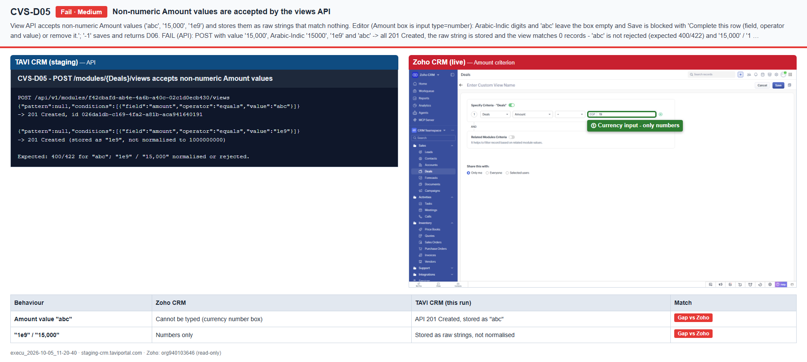

---
### 7. CVS-D16 - Lookup criteria in the view editor take free text only (no record picker); a typed record name is saved literally and matches nothing
**Severity:** Medium · **Case:** Lookup equals, not_equal_to and empty return the correctly linked records · **Area:** Lookup Equals and Empty

**Steps to reproduce**
1. Open Leads → New custom view 'QA CV lookup' with Name starts_with 'QA CV' and Lookup Permission equals X; Save and record the result.
2. Edit row 2 to not_equal_to X, then empty; record each.
3. Cross-check: apply the same Lookup Permission condition in the Leads Filter panel, or call GET /api/v1/modules/841043e1-c078-41f9-8d6e-dfd61bee45c3/records?filters=<same condition>, and compare the total with the grid's record count.
4. Cleanup: delete 'QA CV lookup' and purge it from the Recycle Bin.

**Expected:** equals X → L01, L02. not_equal_to X → L03 (L04 handled as the module filter does). empty → L04 only. Counts equal the module filter.

**Actual (this run):** Seeds Q01 -> contact X (QA CV C01), Q02 -> X, Q03 -> Y (QA CV C02), Q04 empty. API with the stored form '<module id>:<record id>': equals X -> Q01, Q02; not_equal_to X -> Q03, Q04 (empty included); is_empty -> Q04; is_not_empty -> Q01, Q02, Q03 - grid equals the module filter. FAIL (editor): the value for Lookup Permission is a plain text box ('Value for Lookup Permission') with no record search, picker or suggestions; typing the record name 'QA CV C01' saves the literal text and the view returns 0 records. A bare record id also matches nothing. A user cannot build a working lookup criterion in the editor.

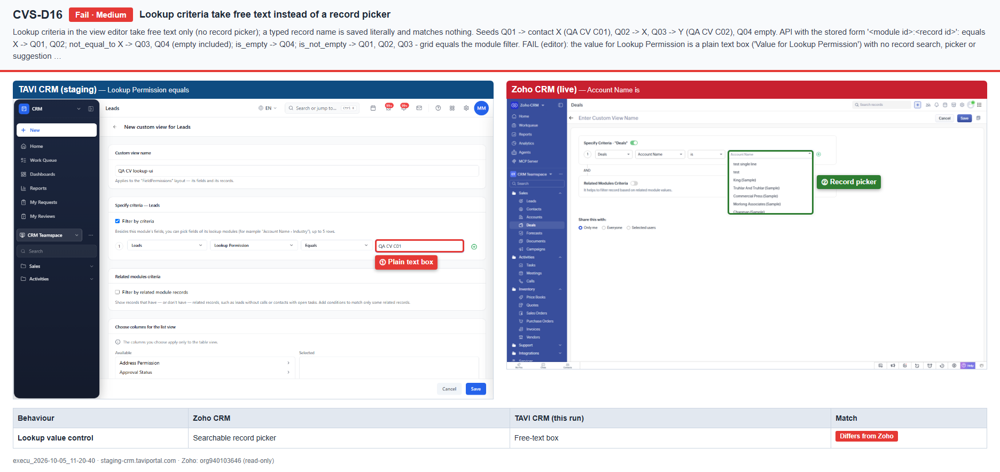

---
### 8. CVS-D19 - View API accepts an operator that does not fit the field type (Amount 'contains' -> 201)
**Severity:** Medium · **Case:** A view definition with an unknown field or operator is rejected by the API with 400/422 · **Area:** Unknown Field or Operator via API

**Steps to reproduce**
1. GET /api/v1/modules/841043e1-c078-41f9-8d6e-dfd61bee45c3/views?kind=list and save the list of ids.
2. POST /api/v1/modules/841043e1-c078-41f9-8d6e-dfd61bee45c3/views named 'QA CV bad-field' with condition field 'does_not_exist_c'.
3. POST again named 'QA CV bad-operator' with a valid field and operator 'xor_like'.
4. POST /api/v1/modules/f42cbafd-ab4e-4a6b-a40c-02c1d0ecb430/views named 'QA CV wrong-type' with Amount and operator 'contains'.
5. PATCH an existing QA CV view with the unknown field; record the status code.
6. GET the views list again and compare with step 1.
7. Cleanup: delete any 'QA CV' view created by mistake and purge it from the Recycle Bin.

**Expected:** Every request returns 400/422 with a validation error — never 200 or 500. No view is created or changed; the views list matches step 1. Cross-check: the same field/operator is not offered in the Leads Filter panel.

**Actual (this run):** Unknown field does_not_exist_c -> 422 unknown_field 'That field does not exist on this module.'; unknown operator xor_like -> 422 'not a supported operator'; PATCH with the unknown field -> 422, control view unchanged; views list unchanged. FAIL: Deals 'QA CV wrong-type' with Amount (currency) + operator contains -> 201 Created - an operator that is not valid for the field type is accepted.

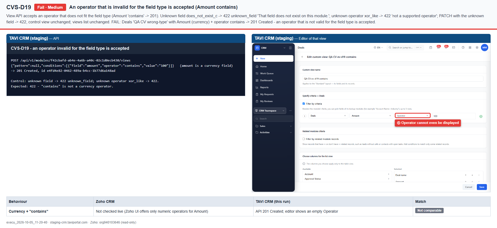

---
### 9. CVS-D24 - Arabic UI: the criteria pattern '(1 or 2) and (3 or 4)' is displayed as '( and (3 or 4) (or 2 1) )'
**Severity:** Medium · **Case:** In the Arabic UI the pattern's row numbers, brackets and and/or read correctly · **Area:** Pattern Editor in RTL

**Steps to reproduce**
1. Open Leads → New custom view 'QA CV rtl-pattern' with four rows: Lead Status equals S1, Lead Status equals S2, Comment is_not_empty, Name starts_with 'QA CV'.
2. Enter the pattern (1 or 2) and (3 or 4) and read it as displayed.
3. Save, reopen the editor and read the pattern again.
4. Switch to English, open the same view and compare the results.
5. Cross-check: apply the same pattern in the Leads Filter panel, or call GET /api/v1/modules/841043e1-c078-41f9-8d6e-dfd61bee45c3/records?filters=<same condition>, and compare the total with the grid's record count.
6. Cleanup: delete 'QA CV rtl-pattern' and purge it from the Recycle Bin.

**Expected:** In Arabic, row numbers, brackets and the and/or connectors display in the correct order with brackets correctly paired (not reversed or misplaced). The results are identical in Arabic and English and equal the module filter count.

**Actual (this run):** Run as ALT1. 'QA CV rtl-pattern' with rows Lead Status = No Answer, Lead Status = Busy, Comment is not empty, Full Name starts with 'QA CV' and pattern '(1 or 2) and (3 or 4)'. UI switched to Arabic (dir=rtl). FAIL: the editor shows the pattern as '( and (3 or 4) (or 2 1) )' - brackets and token order scrambled (English text inside an RTL line without isolation). Results identical in Arabic and English (9 records). Switched back to English afterwards.

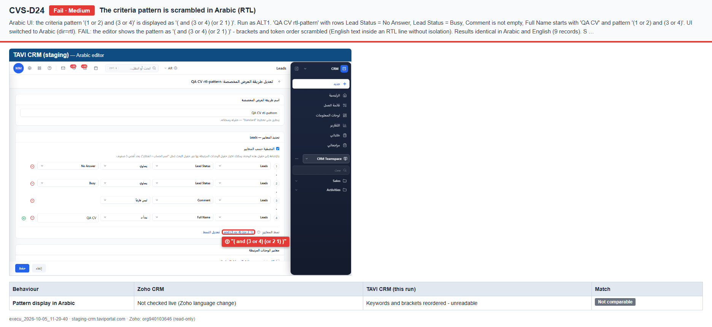

---
### 10. CVS-D25 - 'Last Activity' in view criteria is the record's modified time; adding a note does not update it
**Severity:** Medium · **Case:** Last Activity Time can be used as a criteria field and follows record activity · **Area:** Last Activity Time as Criteria

**Steps to reproduce**
1. On Leads, open New custom view 'QA CV last-activity' and open the criteria field list.
2. Look for Last Activity Time.
3. If offered, set Last Activity Time, Age in Days = 7, add Lead Name starts with QA CV, and Save.
4. Read the results.
5. Add a note to 'QA CV L02' and reload the view.

**Expected:** Last Activity Time is in the criteria field list with the date-time operators. The view returns 'QA CV L01' and not 'QA CV L02'; after the note is added, 'QA CV L02' is returned too (NDC-1868 P1-5; Zoho offers the field — seen live 2 Oct 2026). If the field is not offered, mark Fail and note it.

**Actual (this run):** 'Last Activity' is offered in the criteria field list with the date-time operators. FAIL: it is the record's modified time, not an activity time - a note added to QA CV L02 (POST notes 201) left last_modified_at unchanged (08:47:45Z) and a 'last 1 hour' Last Activity filter does not return L02.

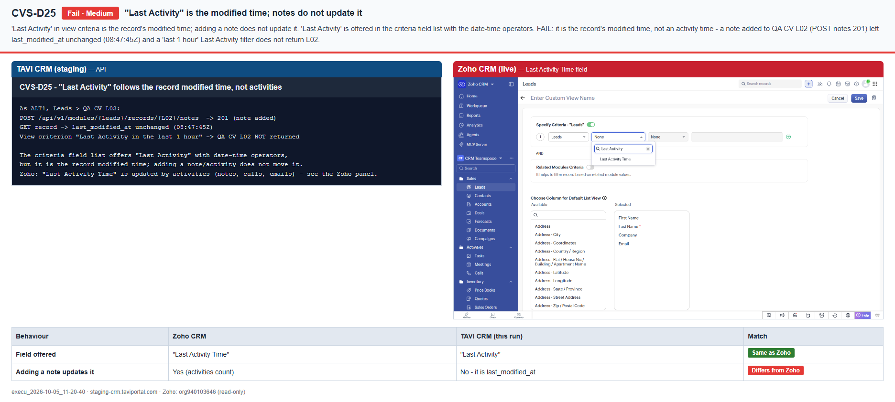

---
### 11. CVS-E2E-1 - After sign-out/sign-in Leads does not reopen the working view the user had open
**Severity:** Medium · **Case:** A pinned working view survives opening a record and signing out and back in · **Area:** Sales Rep Daily List

**Steps to reproduce**
1. On Leads, open New custom view and name it 'QA CV hot leads'.
2. Add: Lead Status contains any of Interested, Follow Up · created date in the last 7 days · Owner = me; Save.
3. Note the record count and three sample record names.
4. Open the tab menu and choose Pin view.
5. Open one of the listed leads, then click Back.
6. Sign out via profile → Logout and sign in again.
7. Open Leads and the view picker.

**Expected:** After Back and after signing in again, 'QA CV hot leads' is still open with the same count and records, its tab is shown, and it is listed under Pinned views.

**Actual (this run):** ALT1 'QA CV hot leads' = (Lead Status Interested OR Follow Up) AND Created Time in the last 7 days (Owner = me left out: the QA CV seeds belong to the Owner account) - 13 records (QA CV L05…L11, L16 …). Pinned. Open QA CV L05, browser Back: same view, 13 records. Pinned views group lists 'QA CV hot leads' after signing in again. FAIL: after signing out (session ended, sign-in form shown) and signing in again, Leads opens on 'QA CV count' (16 records) instead of the working view 'QA CV hot leads' - the view opened by link/back is not kept as the last-used view across sign-in.

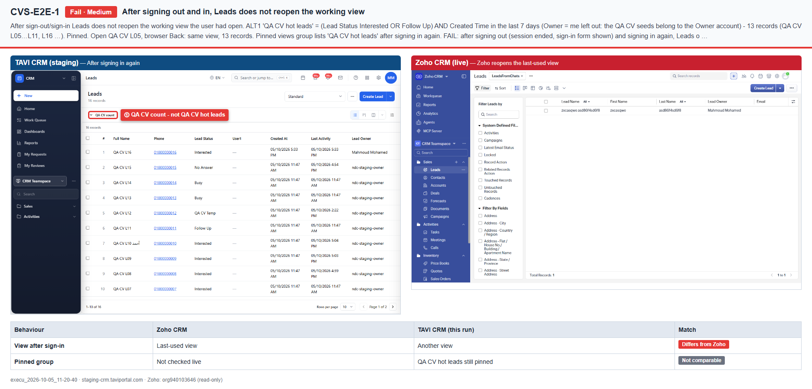

---
### 12. CVS-E09 - Deleted criteria field: no banner on the view's list page (only in the editor, by API name) while the view keeps filtering on the deleted field
**Severity:** Medium · **Case:** A view whose criteria field is deleted shows the deleted-field banner and still runs · **Area:** Criteria Field Deleted

**Steps to reproduce**
1. Open Leads → New custom view 'QA CV temp-field' with Name starts_with 'QA CV' and 'QA CV Temp Number' greater_than 1; Save; confirm L01 is returned.
2. Delete the field 'QA CV Temp Number' from the Leads layout.
3. Open 'QA CV temp-field' from the picker; record the banner and the result.
4. Open its editor and record how the row is shown.
5. Cross-check: apply Name starts with 'QA CV' in the Leads Filter panel, or call GET /api/v1/modules/841043e1-c078-41f9-8d6e-dfd61bee45c3/records?filters=<same condition>, and compare the total with the grid's record count.
6. Cleanup: delete 'QA CV temp-field' and purge it from the Recycle Bin; purge the deleted field if it is in the Recycle Bin.

**Expected:** The banner "Some fields in this view's criteria are deleted or hidden from you: QA CV Temp Number…" is shown, the view still runs with no error, and the result is recorded and consistent with the cross-check.

**Actual (this run):** OWNER created number field 'QA CV Temp Number' (qa_cv_temp_number); L01 = 5, L02 = 0. ALT1 view 'QA CV temp-field' (First name starts with 'QA CV' + QA CV Temp Number > 1) -> L01. OWNER deleted the field (204). The view still runs with no error and still returns only L01 (the stored criterion on the deleted field keeps filtering; Name-only filter gives 19 QA CV rows). FAIL: the list page shows no banner at all; only the editor shows 'Some fields in this view's criteria are deleted or hidden from you: qa_cv_temp_number.' - with the API name, not 'QA CV Temp Number' - and the row reads 'Select a field'. 2 console errors (403) on the page.

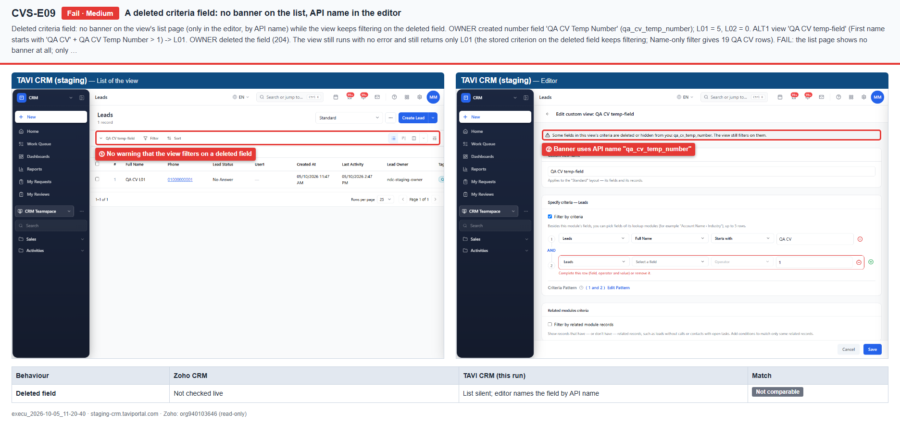

---
### 13. CVS-F01 - Manage Columns on a view with chosen columns offers no hidden/available fields, so a column (e.g. Comment) cannot be added
**Severity:** Medium · **Case:** Manage Columns shows and hides columns, keeps the record-name column locked, and resets · **Area:** Manage Columns

**Steps to reproduce**
1. Open 'QA CV columns' → Manage Columns.
2. Hide Lead Status and show Comment; apply.
3. Try to untick the record-name column (Name).
4. Use the reset option in Manage Columns.
5. Cleanup: delete 'QA CV columns' and purge it from the Recycle Bin.

**Expected:** Lead Status disappears and Comment appears in the grid. Name cannot be unticked or hidden. Reset restores Name, Lead Status, Company.

**Actual (this run):** Run as ALT1 on 'QA CV columns-f' (columns Full Name, Lead Status, Company). Manage Columns lists only VISIBLE (4): Full Name, Lead Status, Company, Lead Owner - no hidden/available list. Hiding Lead Status works (column disappears, banner 'You changed the columns for this view. Only you see this change.'). Full Name's Hide button is disabled (locked). There is no reset option inside Manage Columns; the banner's 'Use the view's columns' restores Full Name, Lead Status, Company. FAIL: Comment cannot be shown - Manage Columns offers no way to add a field that the view does not already show.

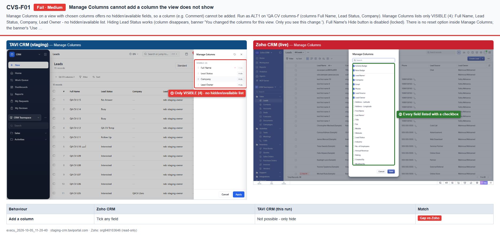

---
### 14. CVS-F03 - Manage Columns cannot add a column to a view (so a new column cannot be saved to the view)
**Severity:** Medium · **Case:** "Save to view" writes the owner's column change into the view and "Use the view's columns" removes an override · **Area:** Save to View and Reset

**Steps to reproduce**
1. Open 'QA CV save-cols' → Manage Columns → add Comment; apply.
2. Click "Save to view".
3. GET /api/v1/modules/841043e1-c078-41f9-8d6e-dfd61bee45c3/views/{id} and read settings.columns and row_version.
4. Manage Columns → hide Company; apply; then click "Use the view's columns".
5. Read the grid and GET list-preferences.
6. Cleanup: delete 'QA CV save-cols' and purge it from the Recycle Bin.

**Expected:** After "Save to view", settings.columns is Name, Lead Status, Company, Comment and row_version increases. After "Use the view's columns", the grid shows those four columns again and the override is gone from list-preferences.

**Actual (this run):** Run as ALT1 on 'QA CV save-cols' (Full Name, Lead Status, Company). Step 1 (add Comment) cannot be done: Manage Columns does not offer Comment (same cause as F01). Tested the rest with a hide instead: hide Company -> banner with 'Save to view' and 'Use the view's columns'; Save to view -> settings.columns first_name, lead_status, owner and row_version 1 -> 2; then hide Lead Status -> 'Use the view's columns' restores the view's columns and the override is gone from list-preferences. Note: 'Save to view' also wrote the default Lead Owner column into the view.

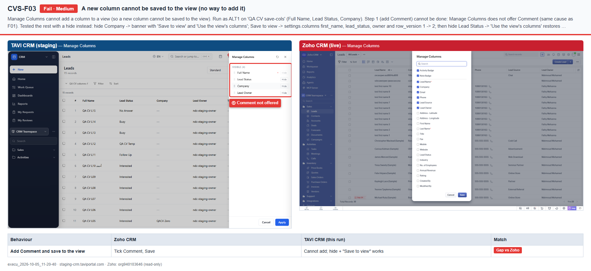

---
### 15. CVS-F10 - Row selection is kept when switching to another view (bar still '3 selected')
**Severity:** Medium · **Case:** Switching view clears the row selection · **Area:** Selection Cleared on View Change

**Steps to reproduce**
1. Open 'QA CV select' and select 3 rows.
2. Switch to All Leads; read the selection bar.
3. Switch back to 'QA CV select' and check the rows.
4. Cleanup: delete 'QA CV select' and purge it from the Recycle Bin.

**Expected:** The selection is cleared on switching: no rows are selected and the bar is gone in both views.

**Actual (this run):** 'QA CV select': L01, L02, L03 selected, bar '3 selected'. Switched to All Leads (URL ?view=All Leads, picker shows All Leads): L01, L02, L03 are still ticked and the bar still shows '3 selected'; switching back to 'QA CV select' - still 3 selected. FAIL: the selection is not cleared when the view changes (the earlier run on crm.taviportal.com cleared it).

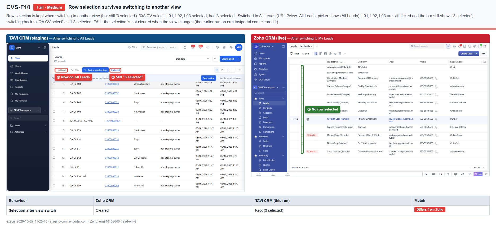

---
### 16. CVS-G04 - Clone in the picker row menu (dropdown layout) does nothing
**Severity:** Medium · **Case:** Cloning the same view twice never fails with a server error on the duplicate name · **Area:** Clone Name Collision

**Steps to reproduce**
1. Open Leads and clone 'QA CV clone-src', keeping the suggested name, and save.
2. Clone 'QA CV clone-src' again, keeping the suggested name.
3. Try to save and read the result.
4. Call POST /modules/841043e1-c078-41f9-8d6e-dfd61bee45c3/views/{v}/clone twice in a row and read both responses.
5. Call GET /modules/841043e1-c078-41f9-8d6e-dfd61bee45c3/views?kind=list and list every view whose name starts with 'QA CV clone-src'.
6. Cleanup: delete 'QA CV clone-src' and every clone of it and purge them from the Recycle Bin.

**Expected:** Each clone either gets a unique generated name or the user is prompted to rename it ("You already have a view with this name."). No request returns a 500 or an unhandled VIEW_NAME_TAKEN error, and no two of OWNER's Leads views share a name.

**Actual (this run):** API: POST …/clone twice -> 201 'Copy of QA CV clone-src' and 201 'Copy of QA CV clone-src (2)'. Tabs layout: Clone from the tab menu twice -> editor suggests 'Copy of QA CV clone-src (3)' / '(4)', saved with toasts. No 500, no VIEW_NAME_TAKEN, no duplicate names among ALT1's views. FAIL (reproduced from the 4 Oct run): in the dropdown layout, the view's 'Actions for QA CV clone-src' menu inside the picker offers Clone, but clicking it does nothing - no POST, no editor, no toast.

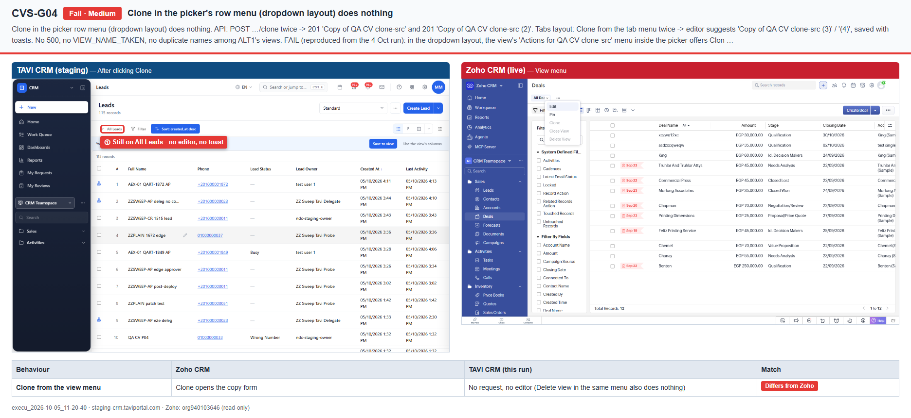

---
### 17. CVS-G06 - The 15-pinned-views limit is not enforced (16th pin accepted in UI and API)
**Severity:** Medium · **Case:** A 16th pin is refused because the limit is 15 pinned views · **Area:** Pin a 16th View

**Steps to reproduce**
1. Open Leads and open the tab menu on 'QA CV pin-16'.
2. Choose Pin view and read the message.
3. Open the picker and count the views under Pinned views.
4. Call PUT /modules/841043e1-c078-41f9-8d6e-dfd61bee45c3/views/{QA CV pin-16 id}/pin and read the response.
5. Call GET /modules/841043e1-c078-41f9-8d6e-dfd61bee45c3/views?kind=list and count views with pinned = true.
6. Cleanup: unpin the views pinned for this test; delete 'QA CV pin-01'…'QA CV pin-16' and purge them from the Recycle Bin.

**Expected:** The 16th pin is refused in the UI with a message stating the limit of 15, and the API returns a 4xx error (no 500). Pinned views still holds exactly 15 views and 'QA CV pin-16' is not pinned.

**Actual (this run):** ALT1 had 0 pins; pinned QA CV pin-01…pin-15 (15 pinned). Tab menu on 'QA CV pin-16': Pin view enabled; clicking it pins the view with no message (16 pinned). PUT …/views/{pin-16}/pin -> 204. GET: 16 pinned, pin-16 pinned=true; Pinned views group lists 16. Expected a refusal stating the 15 limit and a 4xx. All pins removed afterwards.

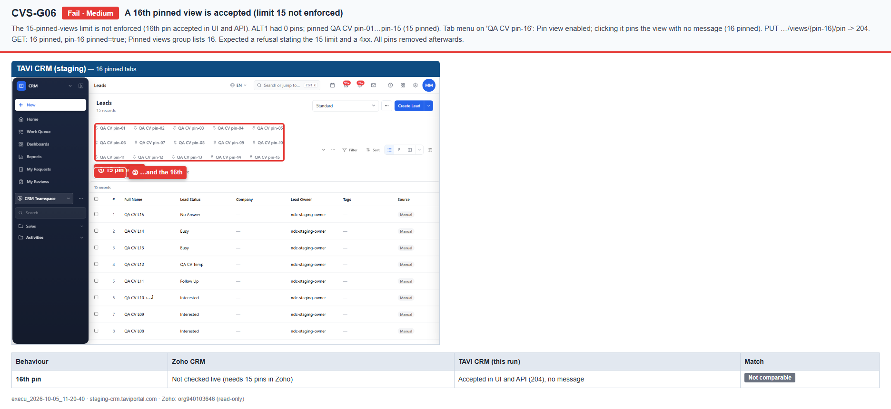

---
### 18. CVS-H14 - Records whose value is beyond the 75-column cap vanish from the Kanban board; board-summary says truncated=false
**Severity:** Medium · **Case:** A board on a pick list with more than 75 values shows the column cap notice · **Area:** More Than 75 Pick List Values

**Steps to reproduce**
1. Create Kanban view 'QA CV kb-80' on Leads with Categorize by: 'QA CV Picklist80'.
2. Open the board and read the notice.
3. Count the columns.
4. Search the board for QA CV L01 and QA CV L02.
5. Call GET /modules/841043e1-c078-41f9-8d6e-dfd61bee45c3/records/board-summary?group_by=<QA CV Picklist80>&view_id=<v> and read truncated.
6. Cleanup: delete 'QA CV kb-80' and purge it from the Recycle Bin; clear the field on QA CV L01 and L02 and delete 'QA CV Picklist80'.

**Expected:** The notice "Only the first 75 values are shown as columns." is shown and the board has 75 value columns plus Unaccounted. Behaviour is consistent and documented: record where QA CV L01 and L02 appear (PRD P1-7 wants an "Other values" column) and the truncated flag from board-summary.

**Actual (this run):** Field 'QA CV Picklist80' (v01…v80) created on Leads; QA CV L01 = v76, QA CV L02 = v80. Kanban 'QA CV kb-80': notice 'Only the first 75 values are shown as columns.'; 75 value columns v01–v75 + Unaccounted (76). FAIL (reproduced from 4 Oct): L01 and L02 appear nowhere on the board - no v76/v80 column, not in Unaccounted, no 'Other values' column (PRD P1-7). board-summary returns columns v76 count 1 and v80 count 1 but truncated=false.

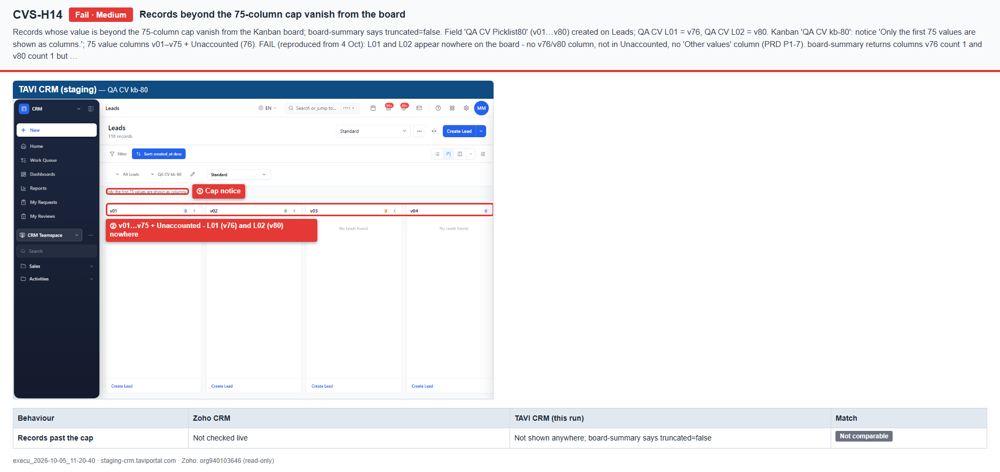

---
### 19. CVS-I04 - A record holding a removed pick-list value is shown in an unmarked extra column - no 'no longer an option' flag
**Severity:** Medium · **Case:** A record holding a value removed from the pick list is flagged on the board · **Area:** Removed Pick List Value

**Steps to reproduce**
1. Open 'QA CV kb-status'.
2. Find QA CV L05 on the board.
3. Read the column and message shown for it.
4. Open QA CV L05 and read Lead Status.
5. Cleanup: move the record back to its original value.

**Expected:** QA CV L05 is still shown on the board, marked with "This value is no longer an option of the field".

**Actual (this run):** QA CV L12 holds 'QA CV Temp', a value added to Lead Status and then removed earlier in this run. Board 'QA CV kb-status': L12 is still shown, in an extra column 'QA CV Temp' (count 1) placed before Unaccounted. FAIL (reproduced from 4 Oct): no 'This value is no longer an option of the field' marker anywhere - not in text, title, aria-label or a tooltip on the column header or the card; the stale column looks like any normal value column and offers 'Create Lead'.

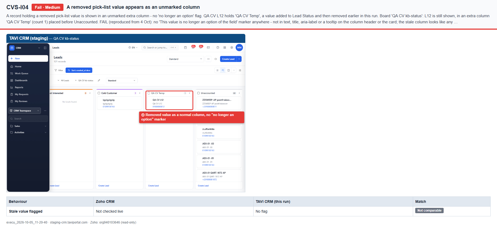

---
### 20. CVS-I05 - Deals Kanban by Stage has no pipeline picker, ignores the pipeline's stages and shows no stage probability
**Severity:** Medium · **Case:** A Deals board by Stage shows the pipeline picker and each stage's probability · **Area:** Deals Pipeline and Probability

**Steps to reproduce**
1. Open 'QA CV deals-by-stage'.
2. Find the pipeline picker and note the pipelines offered.
3. Choose each pipeline in turn and read the columns.
4. Read the probability on each stage header.
5. Compare each probability with the pipeline's stage settings.

**Expected:** The pipeline picker is shown and the columns change to the chosen pipeline's stages. Each stage header shows "Probability N%" matching the configured value.

**Actual (this run):** Deals Standard layout has one pipeline 'Standard' (qualification, needs_analysis, proposal, negotiation, closed_won, closed_lost); the Test layout has two ('Standard Pipeline', 'Test-Pipeline copy'). Board 'QA CV deals-by-stage' (Standard) and 'QA CV deals-test-layout' (Test): no pipeline picker on either board (only the Layout picker); both show all 11 Stage pick-list values (test-01, test-02, qualification … closed_lost_to_competition) instead of the chosen pipeline's stages; no stage header shows 'Probability N%' (the pipeline API carries no probability). Column titles show raw stage keys (needs_analysis, closed_won).

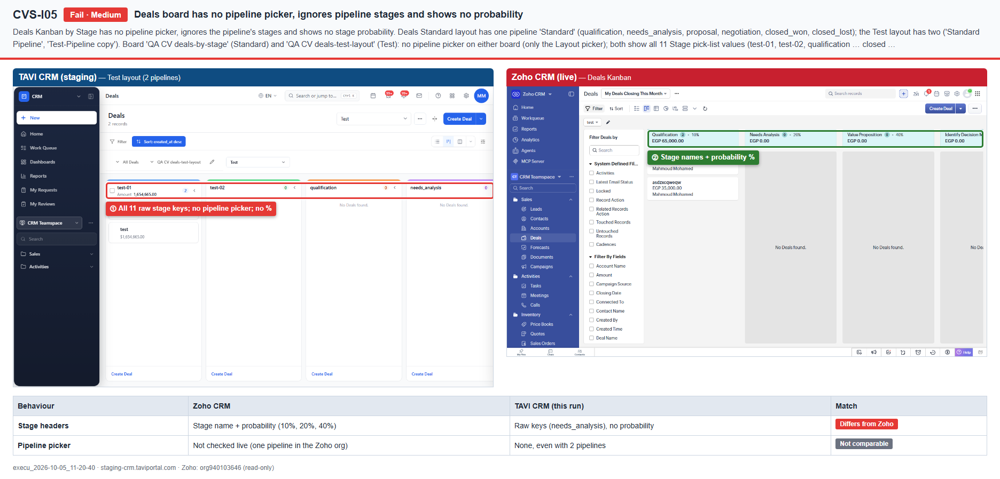

---
### 21. CVS-I09 - Dropping a deal on Closed Won/Lost opens no closing dialog - the move just fails with 'Closing Date is required'
**Severity:** Medium · **Case:** Dragging a deal to Closed Won or Closed Lost opens the closing dialog and enforces its mandatory fields · **Area:** Drag to Closed Won or Lost

**Steps to reproduce**
1. Open 'QA CV deals-by-stage'.
2. Drag QA CV D03 from Negotiation to Closed Lost.
3. Leave the mandatory fields empty and try to confirm.
4. Cancel the dialog and check where the card is.
5. Drag again, fill the mandatory fields and confirm.
6. Open QA CV D03 and read Stage.
7. Cleanup: move the record back to its original value.

**Expected:** A closing dialog opens. It cannot be confirmed while mandatory fields are empty. Cancelling returns the card with nothing saved; completing the fields saves Stage Closed Lost.

**Actual (this run):** QA CV D03 (negotiation) moved to closed_lost on the board: no closing dialog opens; a PATCH is sent and refused - toast 'Closing Date is required to close a deal.'; the card returns to negotiation and Stage is unchanged. Same for closed_won. The user is never offered a dialog to fill the mandatory closing fields, so a deal cannot be closed from the board at all.

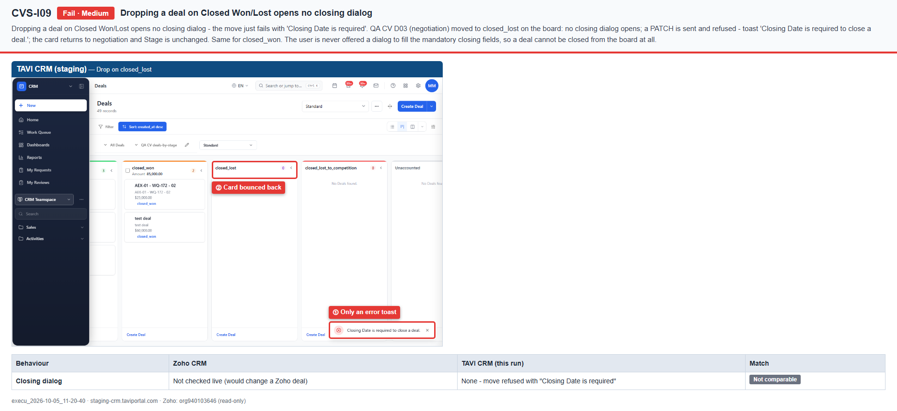

---
### 22. CVS-I11 - Kanban move from a stale board overwrites a newer change with no conflict check
**Severity:** Medium · **Case:** Two sessions moving the same card never lose an update · **Area:** Concurrent Card Moves

**Steps to reproduce**
1. Open 'QA CV kb-status' in both sessions.
2. In session A, drag QA CV L06 from Interested to Follow Up.
3. In session B, without refreshing, drag QA CV L06 from Interested to the next column after Follow Up.
4. Read session B's result.
5. Open QA CV L06 and read Lead Status and its history.
6. Cleanup: move the record back to its original value.

**Expected:** Session B gets a conflict or the board refreshes to the latest state with a message (e.g. "Could not move the record."). The record ends in one consistent state and every saved move appears in its history.

**Actual (this run):** Two tabs (same user, separate pages) on 'QA CV kb-status'. Tab A: QA CV L06 Interested -> Follow Up (saved). Tab B, not refreshed (still showing L06 in Interested): moved L06 to WhatsApp Follow Up -> PATCH accepted, 'Record updated successfully'. Final Lead Status WhatsApp Follow Up; audit shows Interested->Follow Up then Follow Up->WhatsApp Follow Up. No conflict, no 'Could not move the record' and no board refresh in tab B - the stale move silently overwrote A's change (the PATCH carries no version check). L06 restored to Interested.

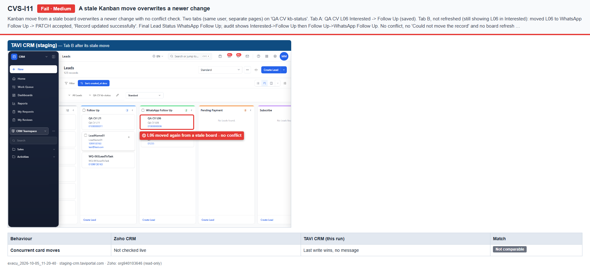

---
### 23. CVS-C02 - View name validation messages are never shown: empty/space-only names just disable Save, and a 121-character name is silently cut to 120
**Severity:** Low · **Case:** The view name is validated and every accepted name is shown as plain text · **Area:** Name Data Sweep

**Steps to reproduce**
1. Click New custom view.
2. Enter the first name from Test Data and click Save.
3. Record the message or the saved name (GET the view).
4. Repeat for every name in Test Data.
5. Open the picker, the tab, the Manage custom views page and the delete dialog for the D11 view.

**Expected:** D1 and D2 are blocked with "Enter a name for the view." D5 is blocked with "A view name can be at most 120 characters." D3, D4, D8, D9 and D10 save and display exactly as typed. D11 is shown as literal text in the picker, tab, Manage page and delete dialog, and no script runs. Behaviour is consistent and documented: whether D6 is stored trimmed, whether D7 is accepted or refused as a duplicate, and whether D14's zero-width and control characters are stripped, rejected or kept. Cleanup: delete every view created (including 'Q' and 'QA CV name') and purge them from the Recycle Bin.

**Actual (this run):** D1 '' and D2 '   ': Save is disabled and 'Enter a name for the view.' is never shown. D5 (121 chars): the input stops at 120 characters, so 'A view name can be at most 120 characters.' never appears (the truncated name then hit 409 VIEW_NAME_TAKEN against the D4 view). D3 'Q', D4 (120), D8 Arabic, D9 (RLM kept), D10 emoji saved exactly as typed. D6 stored trimmed ('QA CV trim'). D7 'qa cv NAME' refused as a duplicate of 'QA CV name' (409, names are case-insensitive). D14 zero-width space and U+0007 kept as typed. D11 '' shown as literal text in the tab, picker, Manage page and delete dialog; no  element, no script ran.

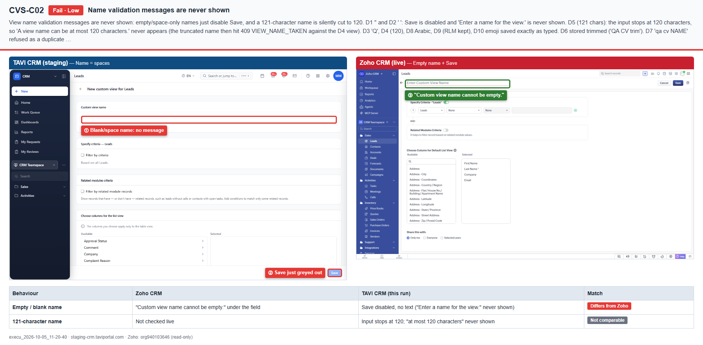

---
### 24. CVS-C09 - A view's grid shows two columns that were not chosen (Tags and Source are always appended)
**Severity:** Low · **Case:** The grid shows exactly the chosen columns in the chosen order · **Area:** Choose and Order Columns

**Steps to reproduce**
1. Click New custom view and enter the name.
2. Choose the eight columns in Test Data.
3. Reorder them to the order in Test Data.
4. Click Save and open the view.

**Expected:** The grid shows exactly those eight columns in exactly that order. Cleanup: delete 'QA CV columns' and purge it from the Recycle Bin.

**Actual (this run):** Run as ALT1. Editor (Standard layout): added Full Name, Lead Status, Company, Email, Phone, Lead Owner, Created At, Last Activity in that order ('Modified Time' is not offered; Last Activity = last_modified_at). Saved (201); stored columns in exactly that order. Grid after selecting the view: Full Name, Lead Status, Company, Email, Phone, Lead Owner, Created At, Last Activity - order correct - but two unchosen columns, Tags and Source, are appended.

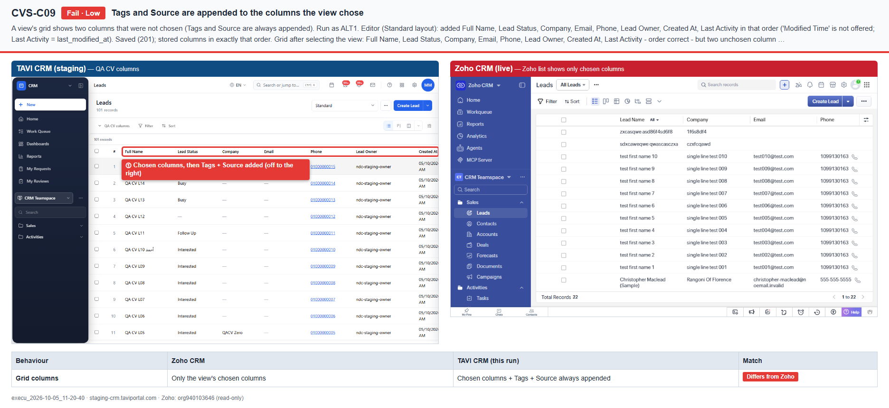

---
### 25. CVS-C12 - Page size 200 is accepted by the server but cannot be chosen in the editor; with 200 stored the editor shows 'Select…' and the grid's Rows per page reads 10
**Severity:** Low · **Case:** Sort and page size are applied and out-of-range page sizes are refused · **Area:** Sort and Page Size

**Steps to reproduce**
1. Create a view sorted by Created Time descending with page size 10; open it.
2. Edit it to page size 200; open it.
3. Edit it to "Each person's usual"; open it.
4. Send PATCH /api/v1/modules/{m}/views/{v} with page_size 9.
5. Send PATCH with page_size 201.

**Expected:** The grid is sorted by Created Time descending and shows 10, then 200 rows per page, then the viewer's usual page size. The PATCHes with 9 and 201 are rejected and the stored page size is unchanged. Cleanup: delete 'QA CV sort-page' and purge it from the Recycle Bin.

**Actual (this run):** Works: 'QA CV sort-page' sorted Created At descending (header 'Created At ↓') with page size 10; PATCH page_size 9 and 201 -> 422 'Page size must be a whole number between 10 and 200.', stored value unchanged. FAIL: the editor offers only Each person's usual page size / 10 / 25 / 50 / 100 - 200 cannot be chosen although the server accepts it (PATCH 200 -> 200). With 200 stored, the editor shows 'Select…' and the grid shows 1–101 of 101 rows while its Rows per page control reads 10.

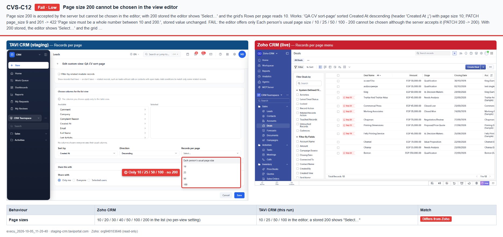

---
### 26. CVS-D14 - A pick list value removed from the field is not shown in the view editor (blank 'Value', no warning), although the view still filters on it
**Severity:** Low · **Case:** Picklist operators split records correctly and a value later removed from the picklist does not crash the view · **Area:** Picklist Removed Value

**Steps to reproduce**
1. Open Leads → New custom view 'QA CV picklist' with Name starts_with 'QA CV' and Lead Status equals S1; Save; then edit to not_equal_to S1, contains_any_of S1,S2 and contains_none_of S1,S2; record each result.
2. In the Leads layout, add the pick list value 'QA CV Temp' to Lead Status and set L12 to it.
3. Edit the view to Lead Status equals 'QA CV Temp'; Save; confirm L12 is returned.
4. Remove 'QA CV Temp' from the Lead Status pick list.
5. Reopen the view and its editor; record the result and how the stale value is shown.
6. Cross-check: apply the same Lead Status condition in the Leads Filter panel, or call GET /api/v1/modules/841043e1-c078-41f9-8d6e-dfd61bee45c3/records?filters=<same condition>, and compare the total with the grid's record count.
7. Cleanup: restore L12's status; delete 'QA CV picklist' and purge it from the Recycle Bin.

**Expected:** equals S1 → only S1 leads; not_equal_to S1 → the rest (empty status handled as the module filter does); contains_any_of → S1 and S2 leads; contains_none_of → the rest. After the value is removed the view opens with no crash or error, the stale value is shown in the editor, and the results are consistent with the module filter (record them).

**Actual (this run):** S1 = No Answer, S2 = Busy. equals S1 -> L01, L15; not_equal_to S1 -> the rest incl. empty-status L12; contains_any_of S1,S2 -> L01, L02, L13, L14, L15; contains_none_of -> the rest (all equal the module filter). OWNER added 'QA CV Temp' to Lead Status and set L12 to it; view equals 'QA CV Temp' -> L12. OWNER removed the value again (back to 16 values). Reopened: the grid works and still returns L12 showing 'QA CV Temp', no crash. FAIL: the editor shows the row as 'Lead Status \| Equals \| Value' - the stored value is not shown (a normal value such as 'No Answer' is shown) and there is no notice that it is no longer an option. Also 2 console errors (403) when ALT1 opens the editor.

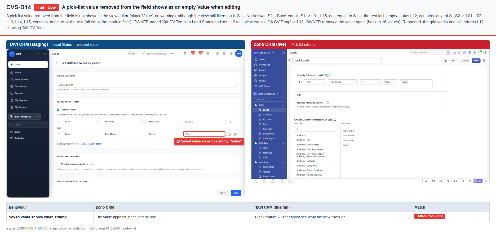

---
### 27. CVS-D21 - An unbracketed criteria pattern is stored and redisplayed as typed instead of in its fully bracketed form
**Severity:** Low · **Case:** The pattern 1 or 2 and 3 is read left to right as ((1 or 2) and 3) and the results match that grouping · **Area:** Left-to-Right Precedence

**Steps to reproduce**
1. Open Leads → New custom view 'QA CV precedence' and add the three rows in Test Data.
2. Set the pattern to 1 or 2 and 3 (no brackets) and read the editor help text.
3. Save and record which of L01–L04 are returned.
4. Reopen the editor and read the saved pattern.
5. Cross-check: apply ((Lead Status = S1 or Lead Status = S2) and Comment is not empty) in the Leads Filter panel, or call GET /api/v1/modules/841043e1-c078-41f9-8d6e-dfd61bee45c3/records?filters=<same condition>, and compare the total with the grid's record count.
6. Cleanup: delete 'QA CV precedence' and purge it from the Recycle Bin.

**Expected:** The editor help says "Conditions are read from left to right". Results follow ((1 or 2) and 3): L02 and L03 are returned; L01 is not (it would be under (1 or (2 and 3))); L04 is not. The saved pattern reopens fully bracketed as ((1 or 2) and 3), and the count equals the module filter.

**Actual (this run):** Rows: Lead Status = No Answer, Lead Status = Busy, Comment is not empty (+ Full Name starts with 'QA CV P' to isolate P01-P04). Pattern typed '1 or 2 and 3 and 4'. The help ('read from left to right') is present as a tooltip on the pattern help icon. Results P02, P03 - correct for ((1 or 2) and 3); P01 and P04 not returned. FAIL: the saved pattern is stored and reopened exactly as typed ('( 1 or 2 and 3 and 4 )'), not fully bracketed as ((1 or 2) and 3).

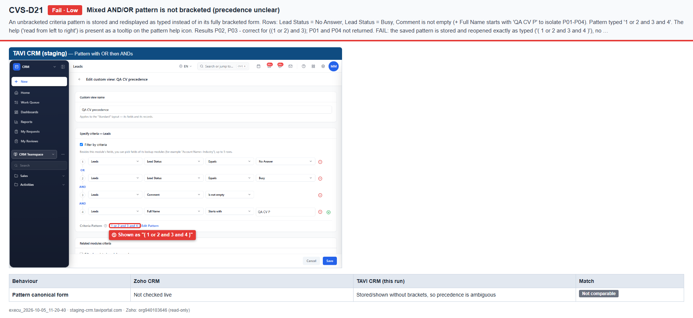

---
### 28. CVS-D22 - Upper-case 'AND' pattern is accepted by the editor and the API (case expects it to be rejected)
**Severity:** Low · **Case:** Every invalid criteria pattern is blocked in the editor and rejected by the API · **Area:** Invalid Pattern Sweep

**Steps to reproduce**
1. Open Leads → New custom view 'QA CV bad-pattern' and add three rows (Name starts_with 'QA CV', Lead Status is_not_empty, Comment is_empty).
2. Enter each 3-row pattern in Test Data; click Save; record the message.
3. Add rows to 5 for the depth-4 pattern and to 25 for the 201-character pattern; Save each and record the message.
4. POST /api/v1/modules/841043e1-c078-41f9-8d6e-dfd61bee45c3/views with each pattern and record the status code.
5. GET /api/v1/modules/841043e1-c078-41f9-8d6e-dfd61bee45c3/views?kind=list and confirm no 'QA CV bad-pattern' exists.
6. Click Cancel.

**Expected:** For every pattern the editor shows "Fix the criteria pattern: every row number must appear once, and brackets must match." (or a more specific message) and Save is blocked. The API rejects every pattern with 400/422. No view is created.

**Actual (this run):** Editor: every invalid pattern disables the pattern Save and shows a specific message (e.g. 'Brackets are not balanced.'); the view Save is paused while the pattern is edited. API: every invalid pattern -> 422 with a specific message (unbalanced, unexpected ')', two operators, ends unexpectedly, criteria 5 does not exist, criteria 3 missing, criteria 1 used twice, unknown word xor, nests deeper than 3 levels, at most 200 characters). FAIL: the upper-case pattern '1 AND 2 AND 3' is accepted by the editor and by the API (201), although the case lists it as invalid.

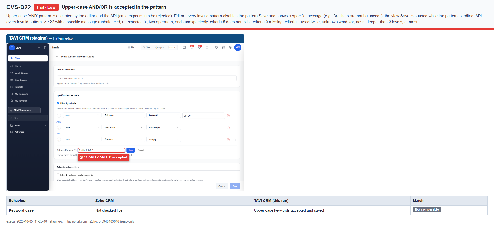

---
### 29. CVS-E07 - Module with no related modules: the editor still shows an empty related block and an enabled 'Add condition'
**Severity:** Low · **Case:** A module that no other module looks up shows "No module has a lookup to {{module}} yet." · **Area:** Module Without Lookups

**Steps to reproduce**
1. Call GET /api/v1/modules/{m}/related-modules for Tasks and Subscriptions; pick one that returns no modules.
2. Open that module → New custom view.
3. Open the related modules section.
4. Click Cancel.

**Expected:** The related modules section shows "No module has a lookup to {{module}} yet." with the module's name, and no related block can be added.

**Actual (this run):** Tasks and Subscriptions both have related modules, so module 'test' (no related modules) was used. New custom view -> Related modules criteria shows 'No module has a lookup to test yet.' (module name filled in). FAIL: an empty related block is still rendered and 'Add condition' stays enabled and adds more empty blocks (1 -> 2). Expected: no related block can be added.

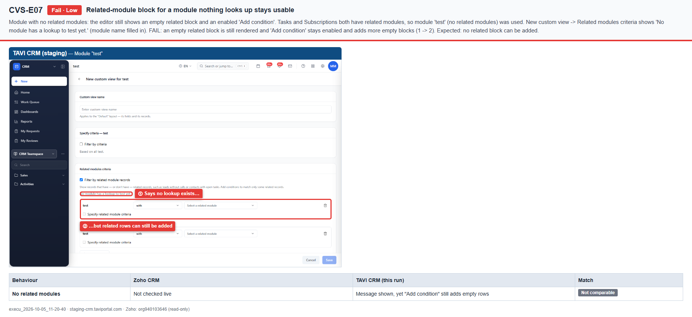

---
### 30. CVS-F04 - List preferences accept more than 50 column overrides (51 stored); no oldest-dropped or 4xx rule
**Severity:** Low · **Case:** A 51st column override is handled by one recorded rule (oldest dropped or rejected) · **Area:** Column Override Limit

**Steps to reproduce**
1. GET /api/v1/modules/841043e1-c078-41f9-8d6e-dfd61bee45c3/list-preferences and save a copy.
2. Make sure 51 Leads list views exist; create 'QA CV ov-01'…'QA CV ov-NN' via POST /api/v1/modules/841043e1-c078-41f9-8d6e-dfd61bee45c3/views to make up the number.
3. Apply a column override to each of the 51 views in order (Manage Columns or PUT list-preferences).
4. GET list-preferences; count the overrides and note which view lost or never got one.
5. Cleanup: PUT the saved list-preferences back; delete every 'QA CV ov-' view and purge it from the Recycle Bin.

**Expected:** Behaviour is consistent and documented: either the oldest override (view 1) is dropped and 50 remain, or the 51st is rejected with 4xx. No 500, and the other 50 overrides are intact.

**Actual (this run):** As ALT1: 51 Leads list views (incl. 'QA CV ov-NN'); PUT list-preferences with a column override for each of the 51 -> 200; GET shows all 51 stored (first and last both kept) - neither the oldest dropped nor the 51st rejected; the 50-override limit is not enforced. ALT1's preferences restored afterwards (PUT 200).

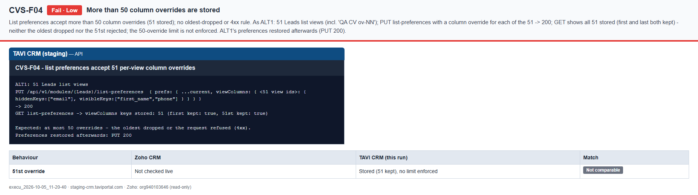

---
### 31. CVS-F06 - Toolbar sort label shows API names ('Sort: amount desc') instead of the field label and direction
**Severity:** Low · **Case:** The toolbar sort control gives the same result as header sort and shows "Sort: field dir" · **Area:** Toolbar Sort Control

**Steps to reproduce**
1. Open 'QA CV sort-deals'; sort Amount descending from the column header; record the order.
2. Reset the sort; choose Amount descending in the toolbar sort control.
3. Record the order and the toolbar label.
4. Cleanup: delete 'QA CV sort-deals' and purge it from the Recycle Bin.

**Expected:** Both methods give the identical order, and the toolbar label reads in the form "Sort: field dir" (Amount, descending).

**Actual (this run):** 'QA CV sort-deals': header Amount descending and toolbar Sort (Amount, Descending, Apply) give the identical order D08, D07, D04, D03, D02, D01, D06, D05 (empty last). FAIL: the toolbar label reads 'Sort: amount desc' - internal field and direction keys, not 'Amount' / 'Descending' as in the sort dialog.

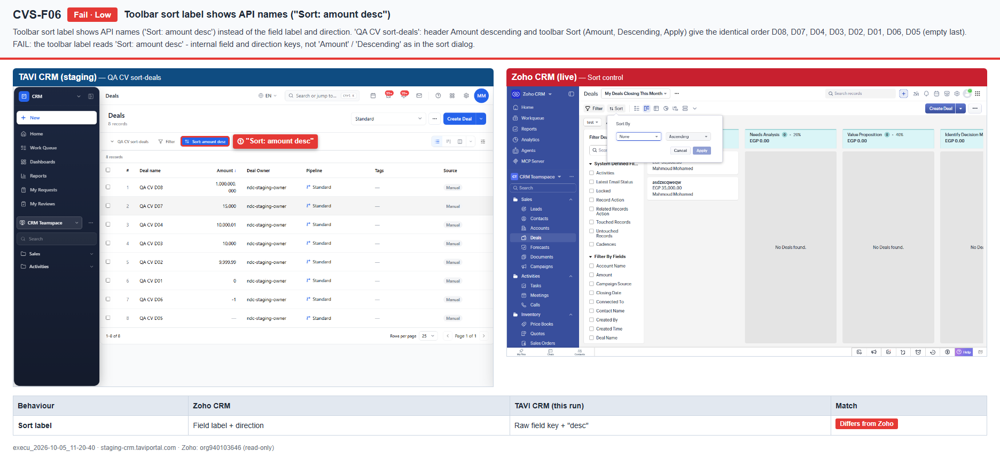

---
### 32. CVS-F07 - Rows per page offers 10/25/50/100 only - 200 is missing
**Severity:** Low · **Case:** Each page size shows the right number of rows, a correct page indicator and a partial last page · **Area:** Page Size and Paging

**Steps to reproduce**
1. Open All Leads and note the record count N.
2. Set records per page to 10; record rows on page 1, the page indicator, and rows on the last page.
3. Repeat for 25, 50, 100 and 200.
4. GET /api/v1/modules/841043e1-c078-41f9-8d6e-dfd61bee45c3/list-preferences and read pageSize.
5. Cleanup: set the page size back to 25.

**Expected:** Each full page shows exactly the chosen number of rows; the page count is N divided by the size rounded up; the last page shows the remainder; the total stays N. pageSize in list-preferences matches the last choice.

**Actual (this run):** All Leads (109 records): 10 -> 10 rows, 11 pages; 25 -> 25 rows, 5 pages; 50 -> 50 rows, 3 pages; 100 -> 100 rows, 2 pages; pageSize in list-preferences follows the last choice (set back to 25). FAIL: 200 is not offered in 'Rows per page' (options 10/25/50/100) although the case and spec list it.

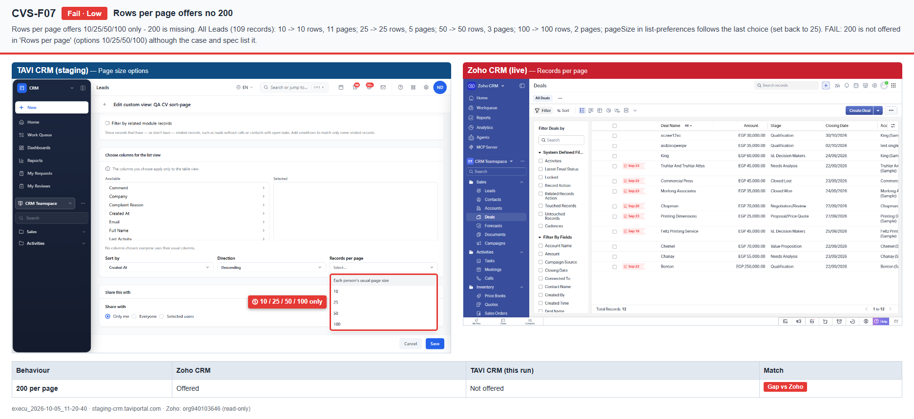

---
### 33. CVS-H05 - Kanban view form: an over-long name gets only 'The view is not valid.' - the 120-character limit is not shown or enforced in the field
**Severity:** Low · **Case:** The Kanban view name is required, limited to 120 characters and rendered as plain text · **Area:** Kanban Name Data Sweep

**Steps to reproduce**
1. Open Leads, switch to Kanban and start a new Kanban view with Categorize by: Lead Status.
2. Leave the name empty (D1) and save; read the message.
3. Enter the 120-character name (D4) and save.
4. Start another view, enter the 121-character name (D5) and try to save.
5. Create a view named with the D11 value and save; open the Kanban chooser, Manage Kanban views and the delete dialog.
6. Call POST /modules/841043e1-c078-41f9-8d6e-dfd61bee45c3/views with kind kanban and the D5 name.
7. Cleanup: delete every 'QA CV' Kanban view created here and purge them from the Recycle Bin.

**Expected:** D1 is blocked with "Give the view a name." D4 saves. D5 is blocked in the form and the API returns a 4xx error (no 500). The D11 name is shown as literal text everywhere and no script runs.

**Actual (this run):** Empty name -> 'A view name is required.' (no request; spec wording 'Give the view a name.'). 120-character name saves. 121 characters: the field has no maxlength, Save sends POST -> 422 INVALID_VIEW name too_long 'A view name may be at most 120 characters.', but the form only shows the generic 'The view is not valid.' - the user is not told the name is too long or what the limit is. API POST kind kanban with 122 characters -> 422 (no 500). Name 'QA CV ' saved; shown as literal text in the chooser and in Manage Kanban views; no  element rendered, no alert.

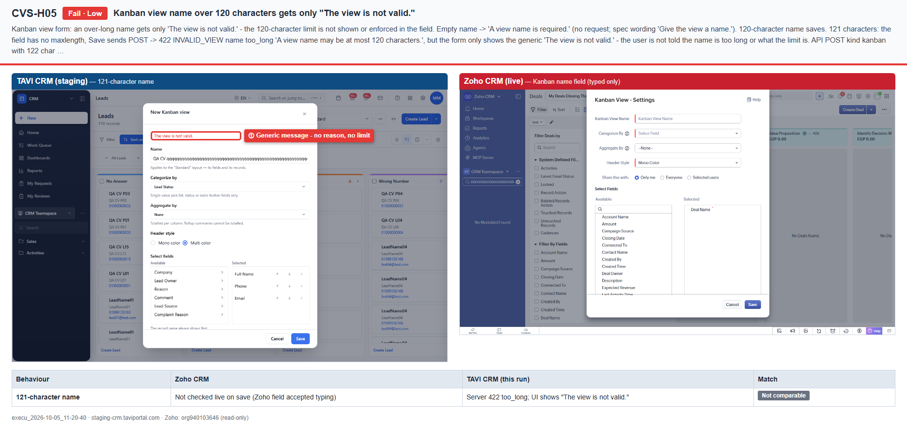

---
### 34. CVS-H10 - Kanban chooser does not label other users' views with 'Shared by <name>'
**Severity:** Low · **Case:** A module holds several Kanban views on different fields, and the chooser switches between them · **Area:** Several Kanban Views per Module

**Steps to reproduce**
1. Create a second Kanban view on Leads with the values in Test Data.
2. Open the Kanban chooser and switch between 'QA CV kb-status' and 'QA CV kb-second'.
3. Read the columns of each board.
4. Find the other user's view in the chooser and read its label.
5. Cleanup: delete 'QA CV kb-second' and purge it from the Recycle Bin.

**Expected:** Both views exist and each board shows the columns of its own field. Other users' views in the chooser show "Shared by <name>".

**Actual (this run):** 'QA CV kb-status' (Lead Status) and 'QA CV kb-second' (Lead Source) both exist; switching in the chooser rebuilds the board: 16 status columns + QA CV Temp + Unaccounted vs chat, web, referral, other + Unaccounted. Test user 1's 'QA CV kb-user1' (shared with everyone) is listed in ALT1's chooser as just 'QA CV kb-user1' - no 'Shared by <name>' label, and own and shared views are not distinguished.

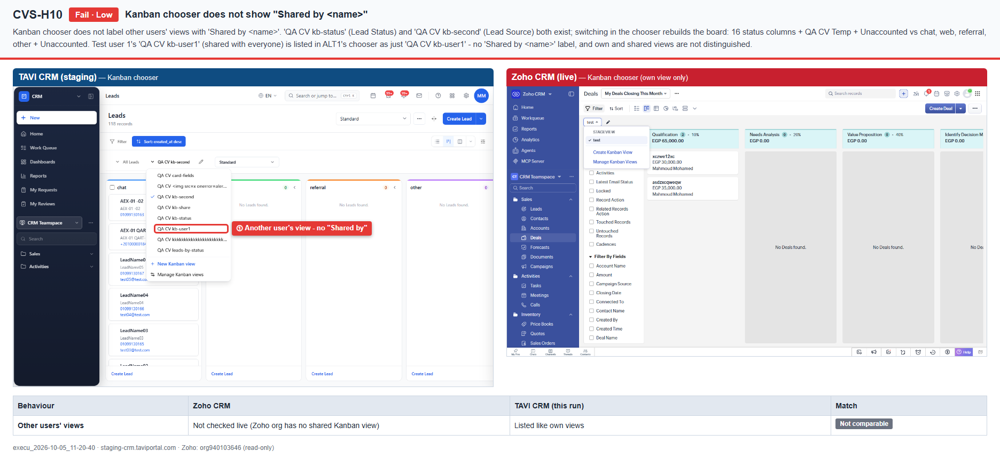

---
### 35. CVS-J03 - Split view criteria: the 'Add criteria row' button silently disables at 10 rows - no limit message
**Severity:** Low · **Case:** A split view refuses too many conditions and values with a message · **Area:** Split View Limits

**Steps to reproduce**
1. Open Leads, switch to Split view and start 'QA CV split-limits' split by criteria.
2. Add criteria conditions one at a time until a message appears.
3. Read the message and record the number of conditions accepted.
4. Split by a field and record the maximum number of values shown as sections.
5. Cleanup: delete 'QA CV split-limits' and purge it from the Recycle Bin.

**Expected:** Adding beyond the limit is refused with the "too many conditions" message, and the maximum number of values is enforced. The condition and value maximums are recorded in the report.

**Actual (this run):** Values: the 'Select Splits' chooser disables the 11th value once 10 are ticked, with 'The selection is limited to a maximum of 10 values.'; API PATCH with 11 splits -> 422 settings.splits too_many 'A split view may have at most 10 splits.' Criteria: 'Add criteria row' becomes disabled after 10 rows. FAIL: no message is shown for the criteria limit - no text, tooltip, title or aria-describedby (the 4 Oct build had the title 'A maximum of 10 criteria rows is allowed'). Maximums recorded: 10 values, 10 criteria rows.

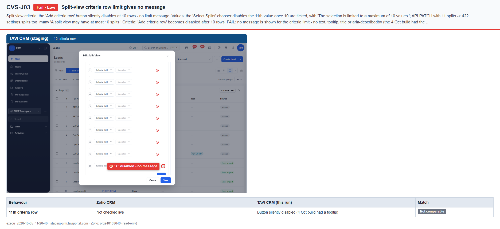

---
### 36. CVS-L01 - Arabic UI: 'records' in the record count and the sort label's field/direction are not translated
**Severity:** Low · **Case:** The picker, editor, manage pages, Kanban and Split are fully translated in Arabic, including user-count plurals · **Area:** Arabic Strings and Plurals

**Steps to reproduce**
1. Open the Leads view picker and read every heading, hint and footer.
2. Open New custom view and go through name, criteria, pattern, columns and sharing.
3. Open Manage custom views and read Shared To for 'QA CV ar-1', 'QA CV ar-2' and 'QA CV ar-3'.
4. Open the Deals Kanban board and Manage Kanban views.
5. Open Split view on Leads.
6. Note every English string or raw translation key.

**Expected:** Every string is in Arabic, with no English fallback or raw key. "{{count}} users" uses the correct Arabic plural form for 1, 2 and 3 (two keys are missing today — record which).

**Actual (this run):** ALT1 switched to Arabic (dir=rtl, lang=ar), restored to English afterwards. Translated: picker button 'طرق العرض المخصصة', picker items ('كل Leads*', 'Leads الخاصة بي*' …), editor ('طريقة عرض مخصصة جديدة لـ Leads', 'تحديد المعايير'), Manage page ('إدارة طرق العرض المخصصة لـ Leads'), Kanban/Split controls. Plurals in Shared To: 1 'مستخدم واحد', 2 'مستخدمان', 3 '3 مستخدمين' - correct forms (the '3' uses a Latin digit while dates use Arabic-Indic digits). FAIL - English left in the Arabic UI: the record count reads '٥٠ records' ('records' untranslated) and the toolbar sort label reads 'ترتيب: created_at desc' (raw field key and direction). Module and field names (Leads, Deals, Full Name) are tenant data and were not counted.

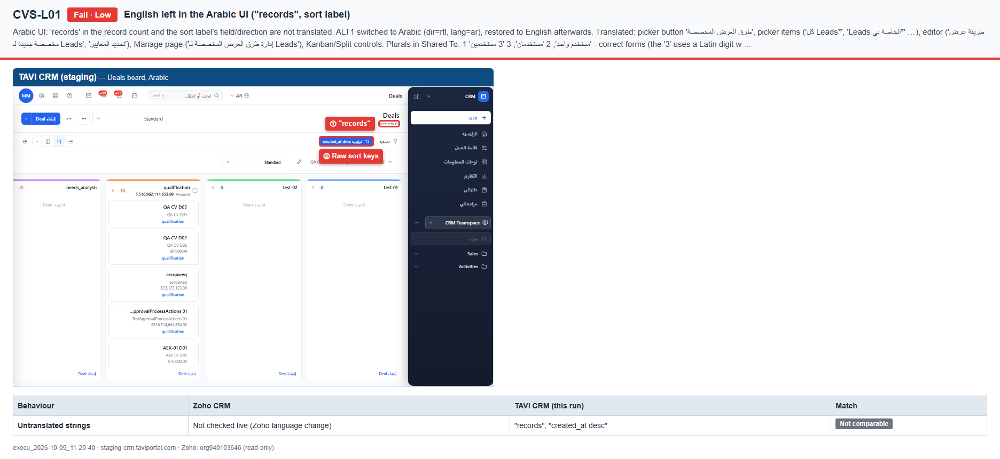

---
### 37. CVS-L03 - Arabic: header layout picker accessible name stays 'Layout'; 'records' untranslated
**Severity:** Low · **Case:** Probability, Layout and Pipeline labels are translated in Arabic · **Area:** Hard-Coded English Fallbacks

**Steps to reproduce**
1. Open 'QA CV ar-stage' on Deals.
2. Read the layout picker label and the pipeline picker label.
3. Read the "Probability {{value}}%" text in each stage header.
4. Switch to English and compare the same three labels.

**Expected:** "Probability", "Layout" and "Pipeline" appear in Arabic; none falls back to English.

**Actual (this run):** Deals board in Arabic: board layout picker 'التخطيط' (translated) but the header layout picker keeps the accessible name 'Layout'; the count reads '٥٠ records'. No pipeline picker and no 'Probability …%' in stage headers in either language (see I05), so those two labels cannot be checked. (Reproduced from 4 Oct.)

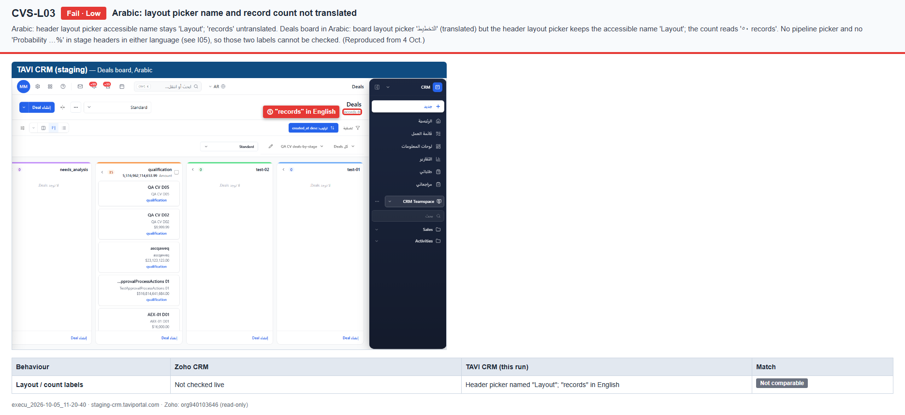

---
### 38. CVS-L04 - Keyboard: focus drops to <body> after 'Add criteria row'; picker list has no arrow-key navigation
**Severity:** Low · **Case:** The picker, view editor, pattern editor and Kanban card move work with the keyboard alone · **Area:** Keyboard-Only Operation

**Steps to reproduce**
1. Without the mouse, open the Leads view picker and open a view with Enter.
2. Open New custom view, name it 'QA CV keyboard', add two criteria rows and Save.
3. Reopen Edit, open the pattern editor, change '1 and 2' to '1 or 2' and Save.
4. On 'QA CV kb-board', move 'QA CV D02' to the next stage with the keyboard.
5. Note any control that cannot be reached or has no visible focus.

**Expected:** Every step completes by keyboard; focus is always visible and never trapped; the card move follows the same rules as a drag.

**Actual (this run):** Keyboard only: focus 'Custom views', Enter -> focus moves to 'Search views'; typing filters; ArrowDown does NOT move into the list (focus stays in the search box); Tab reaches 'QA CV count' and Enter opens it. Editor: name typed, 'Filter by criteria' toggled with Space, 'Add criteria row' with Enter adds a row but focus is lost to the page body. 'Edit Pattern' opens with focus in the pattern box. Kanban card move by keyboard works (I13). FAIL: focus lost after 'Add criteria row'; no arrow-key navigation in the picker menu (reproduced from 4 Oct).

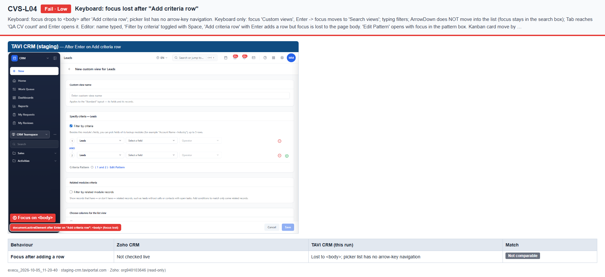

---
### 39. CVS-L05 - Kanban a11y names: card checkboxes reuse the column select-all name, column buttons lack the column name, drag announcements read UUIDs
**Severity:** Low · **Case:** View and Kanban controls expose meaningful accessible names · **Area:** Screen Reader Names

**Steps to reproduce**
1. On Leads, inspect the view picker button and the overflow tab button.
2. On the Deals Kanban board, inspect the Kanban view chooser.
3. Inspect each column's collapse/expand and Load more buttons.
4. Record every accessible name.

**Expected:** The picker reads "Custom views", the overflow button "More custom views" and the chooser "Choose a Kanban view"; every column button has a non-empty name.

**Actual (this run):** Names present: Leads picker 'Custom views', Deals 'Choose a Kanban view', 'Collapse all columns'; 0 unnamed buttons; no 'Load more' (no column over 100). FAIL: (1) every card checkbox carries its column's select-all name ('Select all loaded records in qualification' ×35, negotiation ×10 …); (2) every column button is just 'Collapse column', without the column name; (3) the drag live region reads the record UUID ('77828678-… is over needs_analysis.') instead of the record name. (Reproduced from 4 Oct.)

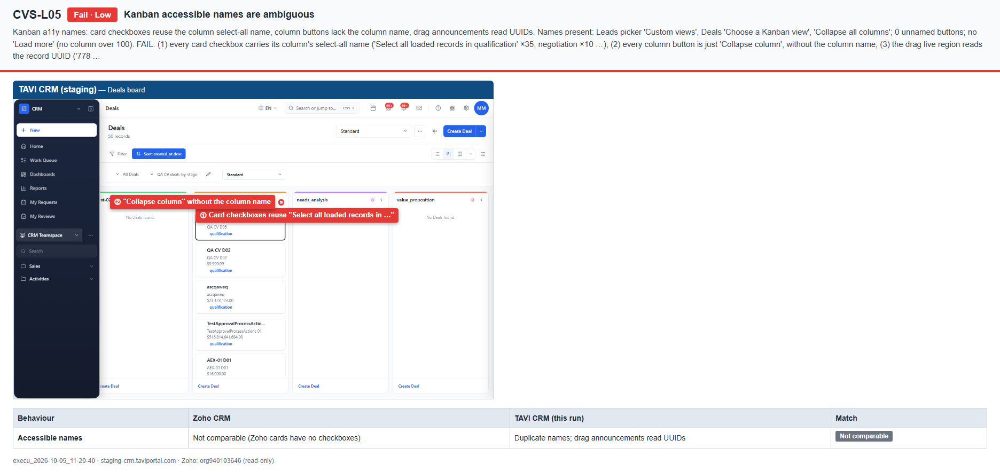

---
### 40. CVS-L06 - At 390 px the 'Create Lead' button is cut off at the right edge
**Severity:** Low · **Case:** At 390 px wide the picker and editor are usable with no horizontal page scroll · **Area:** Mobile Width 390px

**Steps to reproduce**
1. Open Leads, open the view picker, search and open a view.
2. Open New custom view, name it 'QA CV mobile', add one criterion and Save.
3. Try to scroll each screen sideways.
4. Check that no control is cut off or overlaps another.

**Expected:** The picker and editor are fully usable, nothing is cut off, and the page never scrolls horizontally.

**Actual (this run):** Viewport 390x844 (dropdown picker layout): document scrollWidth 390 (no horizontal page scroll); picker button opens by tap and lists views; editor usable - 'QA CV mobile' with Full Name starts with 'QA CV L' saved (201), editor scrollWidth 390. FAIL: the 'Create Lead' / 'More create options' buttons are cut off at the right edge of the header (only 'Crea… Lea…' visible). The 4 Oct tabs-layout break (0 px wide tab list) was not re-checked because this account is in dropdown layout.

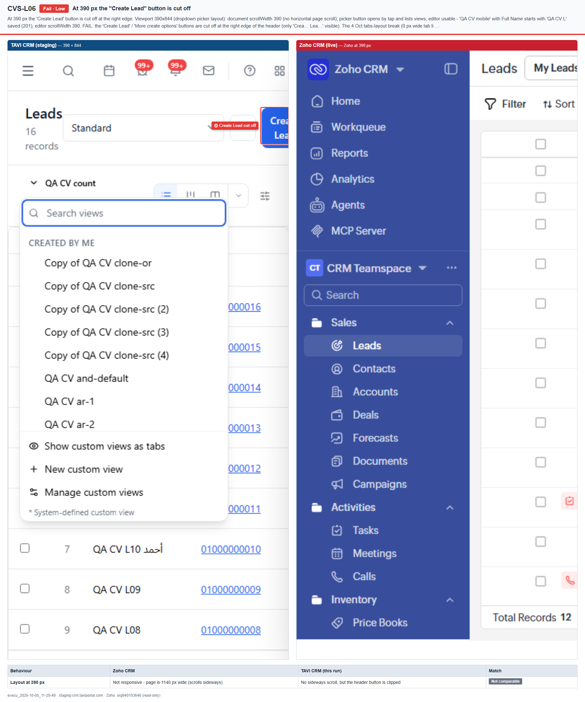

---
### 41. CVS-L07 - Firefox: React ErrorBoundary console error from a lazy-loaded component during the view/Kanban flow
**Severity:** Low · **Case:** Core picker, create-view and Kanban flows behave the same in Edge, Chrome and Firefox · **Area:** Edge, Chrome and Firefox

**Steps to reproduce**
1. In Chrome, open the Leads view picker, search and switch views.
2. Create 'QA CV chrome' with one criterion and Save.
3. On 'QA CV browsers', drag 'QA CV L01' to another Lead Status column, then drag it back.
4. Sign out via profile → Logout.
5. Repeat steps 1–4 in Edge ('QA CV edge') and in Firefox ('QA CV firefox').

**Expected:** Each flow gives the same result in all three browsers, with no console errors or layout breaks; 'QA CV L01' ends with its original Lead Status.

**Actual (this run):** Same flow per browser (fresh sign-in each): picker search + switch to 'QA CV count'; create 'QA CV chrome/edge/firefox' (Full Name starts with 'QA CV L0') -> 201, 9 rows; Kanban 'QA CV kb-status' QA CV L01 No Answer -> Busy -> No Answer (PATCH 200 ×2, final No Answer). Chrome 131.0.6778.205 and Edge 154.0.4258.53: identical, only the unrelated 403 on /telephony/status in the console. Firefox 153.0 (Playwright build): identical results but a React '[ErrorBoundary] … Lazy@unknown' console error (reproduced from 4 Oct). Sign-out step skipped (a new sign-in revokes the previous session anyway). Note: the staging bundle changed during the run (index-Bzy9m5yg.js).

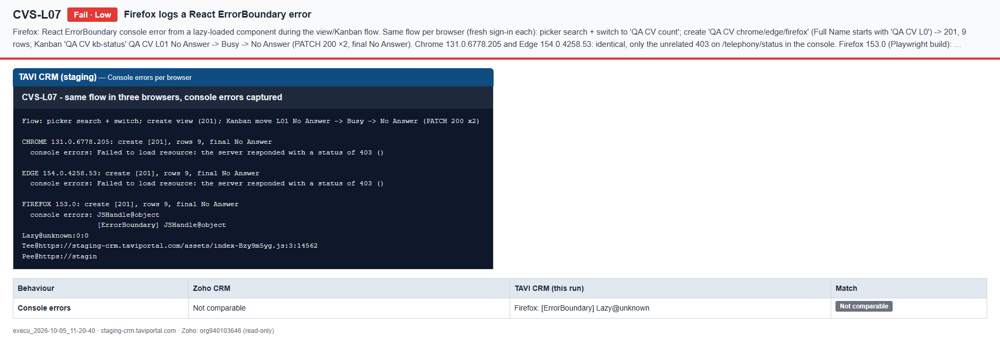

---
### 42. CVS-L08 - List first page p95 far above 1.5 s (Leads 9.1 s, Deals 3.3 s)
**Severity:** Low · **Case:** A list view's first page loads within 1.5 s at p95 on Leads and Deals · **Area:** List View First Page p95

**Steps to reproduce**
1. Open All Leads and reload it 20 times.
2. For each load, record the time from navigation to the first page of rows shown.
3. Repeat steps 1–2 on All Deals.
4. Compute the p95 for each module and note the record counts.

**Expected:** The 95th-percentile first-page time is within 1.5 seconds on both Leads and Deals.

**Actual (this run):** 20 reloads each, navigation -> first row with content (Chromium, cache on, another operator active on the tenant). All Leads (128 records): p95 9125 ms, median 4122, min 2851, max 10116. All Deals (50 records): p95 3300 ms, median 2585, min 1945, max 3696. Target p95 <= 1.5 s missed on both (4 Oct: Leads p95 6826, Deals 3885).

---
### 43. CVS-L09 - Kanban headers + first cards p95 5.1 s (target 2 s)
**Severity:** Low · **Case:** Kanban column headers and first cards render within 2 s at p95 · **Area:** Kanban First Render p95

**Steps to reproduce**
1. Open 'QA CV perf-board' and reload it 20 times.
2. For each load, record the time until every column header (count and sum) and the first cards are shown.
3. Compute the p95.

**Expected:** The 95th-percentile time to headers and first cards is within 2 seconds.

**Actual (this run):** Deals Kanban 'QA CV deals-by-stage' (Stage, Amount; 12 columns), 20 reloads until all column headers with Amount totals and at least one card are shown: p95 5100 ms, median 2290, min 1261, max 26045. Target 2 s p95 missed.

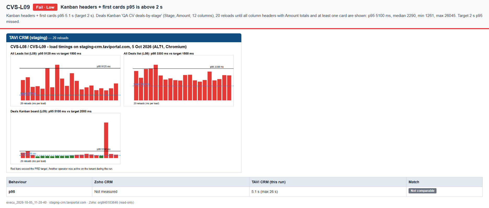

---
## Cases not tested to a verdict (Inconclusive, 16)
| Case | Why |
|---|---|
| CVS-A08 | Needs a user whose profile lacks metadata.records.manage. Both available lower-profile accounts have it (test user 1 'User': metadata.records.manage true; test user 2 'test': true), so the precondition cannot be met. |
| CVS-A09 | Needs a signed-in user of another tenant. The case points to Test Data/AnywareStagingTempAccounts.txt; that credentials file was not used without the tester's go-ahead (credentials are only used from paths the tester gives). |
| CVS-A13 | Still no way to turn custom views off in CRM: this build loads the same featureFlags-Bty4zi8j.js, whose four flags are all hard-coded to return true. No workspace with custom views turned off exists, so the message cannot be reached. |
| CVS-B09 | Needs leads created at 23:50 Cairo on D-1 and 00:10 Cairo on D; created_at cannot be backdated, and no existing lead falls in either window (Today's Leads: 21 records, oldest created 06:22 UTC today). Supporting check: Today's views in 5 modules return only re |
| CVS-E03 | Precondition not met: the case needs a user who can see contact C04 but not deal D08. C04 was given to test user 1 (User profile), but test user 1 can also open D08 (GET 200), so the deal is not hidden. Recorded anyway: as test user 1, without Deals -> C03 onl |
| CVS-E10 | Precondition not met: Percent Permission is not hidden for the User profile (test user 1 receives the field definition), and the Profiles settings page is not reachable on staging-crm.taviportal.com ('You don't have access to CRM'), so the field could not be h |
| CVS-E11 | Precondition not met: Percent Permission is not hidden for the User profile, and the Profiles settings page is not reachable on staging-crm.taviportal.com ('You don't have access to CRM'). |
| CVS-H04 | Every module on NDC-Staging has a groupable field - at least the system 'Approval Status' pick list (Leads, Contacts, Deals, Accounts, Tasks, Calls, Meetings, Subscriptions, test). The 4 Oct run showed that a new custom module with text fields only still gets  |
| CVS-I02 | No Lead Status column holds more than 100 records (largest: Unaccounted 60, Busy 21); on Deals the largest column is qualification with 35. Load more / 100-card paging cannot be exercised on NDC-Staging without bulk-creating records. |
| CVS-I07 | Precondition not met: Lead Status is not required on the Leads layout (required=false). Observation: dragging QA CV L04 (Interested) to Unaccounted sends a PATCH and clears Lead Status ('Record updated successfully', API empty), but right after the drop the ca |
| CVS-I08 | board-summary group_by_blueprint_governed = true for Deals Stage, but the only active blueprint ('AEX-01', another operator's) has entry criteria Amount >= 15,000 AND Deal Name contains 'AEX-01' - no QA CV deal is under it. Moving QA CV D02 qualification -> ne |
| CVS-I10 | Network throttled through the DevTools protocol (2 s latency, 50 KB/s), board reloaded: cards first appeared after 51 s, with no loading indicator left; a keyboard move of QA CV L05 to Follow Up at that moment was accepted (PATCH, 'Dropped … into Follow Up.'). |
| CVS-I17 | 'QA CV deals-by-stage' shared with Everyone (reverted to private afterwards). Test user 1's board, Deals list (49) and board-summary all agree (qualification 35, negotiation 9, proposal 3, closed_won 2, same sums) - but they are identical to ALT1's: test user  |
| CVS-K06 | Random user id part passes: PATCH 'QA CV k6' selected + 00000000-…-0001 -> 422 shared_user_ids[0] unknown_principal 'User not found.'; POST 'QA CV k6-new' with it -> 422, not created; k6 stays private with no shared users. The other-tenant user part was not ru |
| CVS-K08 | Precondition not met: no Deals pick list or number field is hidden from test user 1 (the fields in test user 1's Deals records equal ALT1's), so board-summary on hidden fields cannot be tried. |
| CVS-K11 | Not run: needs a signed-in user of another tenant; the other-tenant account file (AnywareStagingTempAccounts.txt) was not cleared for use in this session. |

## Cleanup
- Deleted 282 recorded view ids where still present (ALT1 198, test user 1 9, test user 2 3, Owner 41, plus 3 found in the final check), 78 seed/test records (Leads, Deals, Contacts, FieldPermissions seeds, QA CV D09, QA CV L16), the field "QA CV Picklist80", the tag "QA CV VIP"; Lead Status is back to its 16 values; all of them purged from the Recycle Bin (the purge endpoint answers 504 Gateway Timeout but the items are gone).
- List preferences: references to deleted views removed for ALT1, test user 1, test user 2 and the Owner; ALT1 and test user 1 back on the dropdown picker and list view; ALT1 back in English.
- Left in place: views of the other operator (named above).

## Correction to execu_2026-10-05_10-50-12
That run marked **CVS-A03** and **CVS-A04** as Fail using test user 1, which turned out to have the Manage Shared Views permission. Re-run in this run with test user 2 (no Manage Shared Views): **both Pass**. The earlier Fail verdicts are withdrawn.
